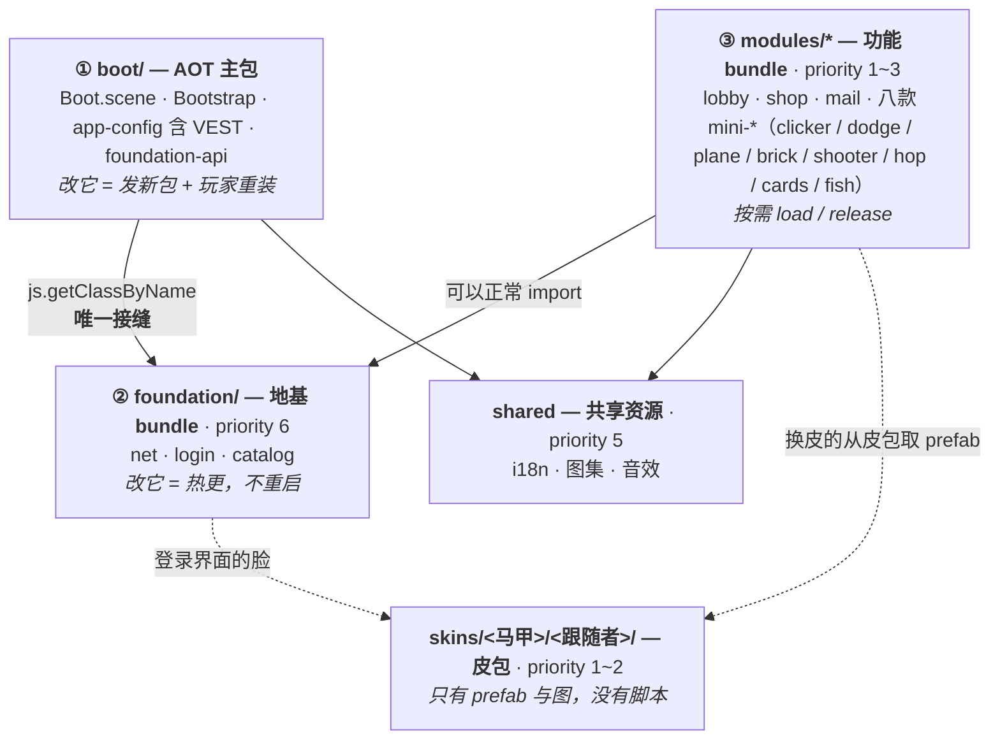

# demo 的分层与分包

## TL;DR

**纵向 = 改它要付什么代价**（AOT → 地基 → 模块），**横向 = 哪个马甲**（收进 `skins/`）。
两个维度正交，不许压在一层。`skins/` 与 `skins/<马甲>/` **不是** bundle，只做目录归类 ——
bundle 不能嵌套；真正的皮包是 `skins/<马甲>/<跟随者>/`，**一个跟随者一个皮包**。

## 架构图



**依赖方向单向向下**，两条铁律：

1. **主包不得 `import` 地基的任何值** —— 那段代码会被判给主包（优先级最高者赢）→ 地基进 AOT
   → 热更失效。唯一接缝是 `boot/foundation-api.ts`：`import type` + `js.getClassByName`。
2. **模块可以正常 `import` 地基的函数与常量** —— `foundation` 优先级（6）高于所有业务包，
   被多包引用的资源归属优先级最高者，同级才各复制一份。不必为了怕复制而全走 DI。
   改优先级前先读 [[adr-0014]]。

## 依赖拓扑与防环

上面那张是**概念图**（谁在哪一层）。下面这张是**实况图** —— 由 `assets/` 的目录 `.meta` 与
`.ts` 里的 `import` 现扫现画，`pnpm check:graph -- --mermaid` 重出一份，不手工维护：

```mermaid
graph BT
  resources["resources · 8"]
  main["main · 7"]
  foundation["foundation · 6"]
  shared["shared · 5"]
  lobby["lobby · 3"]
  skin_base_foundation["skin-base-foundation · 2"]
  skin_vest_foundation["skin-vest-foundation · 2"]
  mail["mail · 1"]
  mini_clicker["mini-clicker · 1"]
  mini_dodge["mini-dodge · 1"]
  mini_plane["mini-plane · 1"]
  mini_brick["mini-brick · 1"]
  mini_shooter["mini-shooter · 1"]
  mini_hop["mini-hop · 1"]
  mini_cards["mini-cards · 1"]
  mini_fish["mini-fish · 1"]
  shop["shop · 1"]
  skin_base_lobby["skin-base-lobby · 1"]
  skin_base_mail["skin-base-mail · 1"]
  skin_vest_lobby["skin-vest-lobby · 1"]
  skin_vest_mail["skin-vest-mail · 1"]
  lobby --> foundation
  mail --> foundation
  mini_clicker --> foundation
  mini_dodge --> foundation
  mini_plane --> foundation
```



**判据一句话：边 `A → B` 合法 ⟺ `priority(B) > priority(A)`。**
箭头只许向上（指向优先级更高、更底层的包）。严格递增意味着拓扑序天然存在 ——
**循环依赖不可能出现**，不需要另跑环检测。排名不另立一张表，就用 Creator 的 bundle 优先级：
那个数字本来就在裁决资源归属，语义就是「谁更底层」，改它时两件事本来就该一起想清楚。

一条规则同时守住三件事：

| | 例 | 不守会怎样 |
|---|---|---|
| **倒挂** | `main`(7) → `foundation`(6) | 就是上面第 1 条铁律。地基那段代码被判给主包 → 地基进 AOT → 热更失效 |
| **同级互引** | `shop`(1) ↔ `mail`(1) · 两个马甲的皮包互借 | 两个包彼此拽住，谁都卸不干净；马甲隔离也一起破 |
| **循环** | 任意长的环 | 卸载顺序无解，且哪个先加载都缺东西 |

两个必须知道的边界：

- **`import type` 不算边** —— 编译期擦除，不是运行时依赖。主包拿地基的唯一合法缝
  （`boot/foundation-api.ts`）正是靠它，写成值 `import` 当场被拦。
- **动态加载不产生边**：`bundle.load()` + `js.getClassByName` 这条路是**故意**绕开静态依赖的。
  拓扑闸保证的是「静态依赖无环」；运行时的加载顺序归 `MODULE_CATALOG` 与 App 的启动阶段管。

### 加载编排与资源边界：`foundation/bundles.ts`

上面那条规则只管「合不合法」。**什么时候装、谁跟着谁装卸、能碰谁的资源**，由地基里的
`BUNDLE_GRAPH` 声明（`Foundation.boot` 第一件事就是 `setGraph` 装上它）：

```ts
{ name: 'mail', needs: ['foundation', () => currentSkinBundle('mail')] }
```

- **装卸跟随**：`load('mail')` 先把地基与这个马甲的邮件皮包装上、各加一次引用，
  `release('mail')` 各减一次。大厅不再手写「两个包一起装、一起卸」。
- **资源边界**：`mayUse(a, b)` = b 在 a 的依赖闭包里。没声明就是越界 ——
  这是**动态引用**（`assets.load(path, { bundle })` / `loadScene` / `registerUI` 的 resolver）
  唯一守得住的方式，那些在构建期一条记录都不产生。
- **表外的包一 `load` 就抛**（`env !== 'prod'` 时）。加了 bundle 忘登记，开发期当场炸。

**加一个模块仍然只改 `catalog.ts` 一行**：模块段按 `MODULE_CATALOG` 现推（模块包 + 登记了换皮的话
它那个皮包），手写的只有启动段那几行。

**启动那一段不归它管**：表住在地基包里，而地基自己是被启动序列装上来的 ——
`shared` / 地基皮包 / `foundation` 仍由 `APP_CONFIG.shared` 装。表接管的是「地基起来之后」。

对账在 `apps/demo/test/foundation/bundles.test.ts`（随 `pnpm test` 跑）：needs 不许指向没登记的包、
不许成环、每个模块与它的皮包都在表里、**源码里每条跨包 `import` 都要在表里有对应的 needs**。

**资源边是另一套规则**：跨包**资源**共享一律经共享仓 `resources`（钉子机制），
不适用优先级递增那条 —— 判据、两道资源闸与「归属会漂」的实况见
[`hotupdate-pipeline.md`](hotupdate-pipeline.md#资源归属一个共享仓别的都不许借) 与 [[bundle-deps]]。

## bundle 全表

| bundle | 源目录 | priority | 什么时候装 | 什么时候卸 |
|---|---|---|---|---|
| `foundation` | `assets/foundation/` | **6** | 启动 `shared` 阶段，**在 `hotupdate` 之后** | 不卸，常驻 |
| `shared` | `assets/shared/` | 5 | 启动 `shared` 阶段 | 不卸，常驻 |
| `lobby` | `assets/modules/lobby/` | 3 | 启动 `lobby` 阶段 | 不卸，常驻 |
| `shop` | `assets/modules/shop/` | 1 | 打开商城时 | 关闭时 |
| `mail` | `assets/modules/mail/` | 1 | 打开邮件时 | 关闭时 |
| `mini-clicker` | `assets/modules/mini-clicker/` | 1 | 打开时 | 关闭时 |
| `mini-dodge` | `assets/modules/mini-dodge/` | 1 | 打开时（`kind:'game'`，自带场景） | 关闭时 |
| `mini-plane` | `assets/modules/mini-plane/` | 1 | 打开时（`kind:'game'`，自带场景 + 自带贴图） | 关闭时 |
| `mini-brick` / `mini-shooter` / `mini-hop` / `mini-cards` | `assets/modules/<id>/` | 1 | 同上 | 关闭时 |
| `mini-fish` | `assets/modules/mini-fish/` | 1 | 同上（自带 **2MB 图集**：`art/textures.{png,plist}`） | 关闭时 |
| `skin-<马甲>-foundation` | `assets/skins/<马甲>/foundation/` | 2 | 启动 `shared` 阶段（在 `APP_CONFIG.shared` 里） | 不卸，常驻 |
| `skin-<马甲>-lobby` | `assets/skins/<马甲>/lobby/` | 1 | 进大厅时 | 不卸 |
| `skin-<马甲>-mail` | `assets/skins/<马甲>/mail/` | 1 | 打开邮件时，与 `mail` 并行 | 关闭时，与 `mail` 一起 |

包名靠目录 `.meta` 的 `bundleName` 覆盖（皮包目录本身不重复 `skin-` 前缀）。
内置的 `main`(7) / `resources`(8) 优先级都高于 `foundation`，所以地基**不会**反过来把 AOT
框架代码吸进热更包。

## 归位判据：新东西放哪一层

问自己一句话 —— **「改它，玩家要付什么代价？」**

| 答案 | 归属 | 例子 |
|---|---|---|
| 必须重装 App | ① `boot/` | 启动编排、`VEST`、dispatcher 地址、引擎模块裁剪 |
| 热更后重启一次 | ② `foundation/` | 协议映射、连接与重连、登录与认证、模块清单 |
| 打开这个功能时才需要 | ③ `modules/<id>/` | 商城的商品列表、邮件的读取逻辑 |
| 所有模块都要，且**没有逻辑** | `shared/` | i18n 表、公共图集、音效 |
| 只是「哪张脸」 | `skins/<马甲>/<跟随者>/` | 所有换皮界面的 prefab 与图 |

四条完整判据（含边界情况）见 [`2026-08-07-demo-assets-layout-v2-proposal.md`](../../../docs/design/2026-08-07-demo-assets-layout-v2-proposal.md)（已实施，封存）。

## 加一个功能模块

1. 新建 `assets/modules/<id>/`，目录 `.meta` 勾 **Asset Bundle**、priority `1`；
2. 逻辑写 VM（零 `cc`，可 node 直跑），View 只做取组件 / 建绑定 / 转发事件与生命周期；
3. 界面 prefab 放模块包内（不换皮）或 `skins/<每个马甲>/<id>/`（换皮，见 [`vest-and-skin.md`](vest-and-skin.md)）；
4. `foundation/catalog.ts` 的 `MODULE_CATALOG` **加一行** —— 大厅代码零改；
5. 单测放 `apps/demo/test/`，路径镜像 `assets/`（`assets/a/BVM.ts` → `test/a/BVM.test.ts`）。

**加模块不必发新包**：`MODULE_CATALOG` 在地基里，热更地基 + 那个模块就能上线一个新功能。

## 已知行为与坑

- **地基必须在 `hotupdate` 之后加载**（`shared` 阶段），否则更新下来的要等下次启动才生效。
  长连接与认证跟着后移到这一步，是这个排序的直接后果。
- **测试不进 `assets/`** —— Creator 会把 `.test.ts` 当游戏脚本打包并炸构建，单测放 `apps/demo/test/`。
- **禁模块级单例**（`export const x = new Foo()` / `static instance` / `getInstance()`）：
  bundle 卸载不卸脚本、编辑器 stop→play 保留 JS 上下文、单 bundle 出包依赖内联，三条都让它
  拿到脏的旧实例。要共享就注册进模块 DI scope。唯一豁免是 `getRootContainer()`。
- **`[...set]` 会被 Cocos 构建降级成 `[].concat(set)`**，集合被塞成单元素 —— 预览测不出、
  只在构建产物炸。一律用 `Array.from`（已有 lint 硬规则）。
- 业务侧 lint 规则要写进 `apps/demo/eslint.config.mjs`（`pnpm lint:demo`）；根
  `eslint.config.js` 把 `apps/**` 整个 ignore 了，加在那里**静默失效**。
