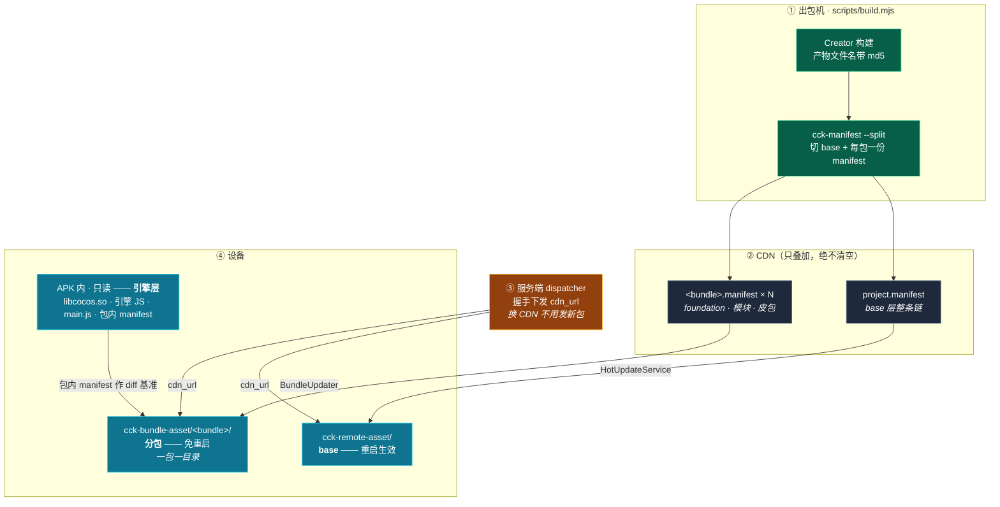
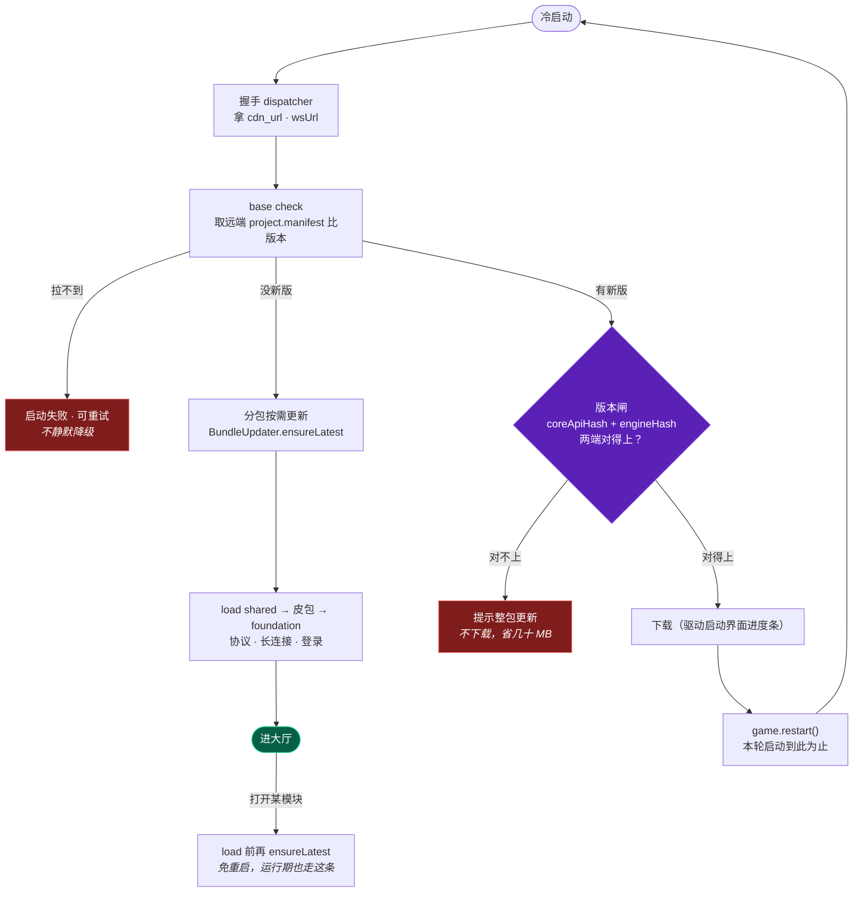
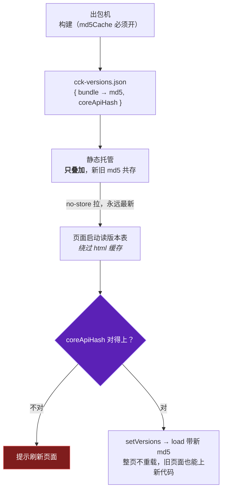

# 热更新一图看懂

## 三个层名（先记这个）

| 层 | 是谁 | 换它要 |
|---|---|---|
| **引擎层** | `libcocos.so` · 引擎 JS · 启动器 `main.js` | 发 APK。相当于 Unity 的 AOT dll：在包里，更新不了 |
| **base 层** | 全部业务代码 · `assets/boot` · `main` / `resources` | 热更，重启生效 |
| **分包层** | `foundation` · `shared` · `skin-*` · `modules/*` | 热更，免重启 |

> 代码里的 `cck-base.json` / `baseStamp` / `DEFAULT_BASE_BUNDLES` 指的都是 **base 层**；马甲是另一维度（`default` / `vest`）。

## 一句话

**改了什么，决定它怎么下去。** 三档，从贵到便宜：

| 代价 | 改到了什么 | 玩家侧表现 |
|---|---|---|
| **发 APK**（引擎层） | 引擎（`libcocos.so` + `cc.<md5>.js`）、启动器 `main.js` | 去商店重装 |
| **热更 · 重启生效**（base 层） | 全部业务代码、`assets/boot`、`main` / `resources` | 启动时下载，自动重启一次 |
| **热更 · 免重启**（分包） | `foundation`、业务模块、皮包 | 无感，下次 `load` 就是新的 |

分界线只有一条：**引擎指纹变了才必须发 APK**，其余都能热更下去。

## 架构图（native）

**地址不烘在包里**：客户端拿握手下发的 `cdn_url` 改写 manifest 里的地址字段再灌回引擎。
唯一还烘死的是 `dispatcherUrl`（链条起点，绕不开）。

## 流程图（native 启动 → 更新 → 进游戏）

三个关键顺序，换了就出事：

- **闸在下载之前** —— 不兼容不白下。
- **地基（`foundation`）排在热更之后** —— 否则更新下来的要等下次启动才生效。
- **检查失败一律中止启动**（可重试），不退回包内版本 —— 静默降级会把发布事故伪装成正常。

## web 那条：一个文件都不用下

引擎按 `assets/<bundle>/index.<md5>.js` 取，浏览器自己会拉；整条流水线只剩一张版本表。

| | native | web |
|---|---|---|
| 更新载体 | 每包一份 manifest（逐文件 md5） | 一张版本表 `cck-versions.json` |
| 谁下载 | 引擎 `AssetsManagerEx` | 浏览器（换文件名 = 换版本） |
| 基址 | dispatcher 下发，运行时注入 | 不需要，跟着页面走（同源） |
| 生效 | base 要重启，分包免重启 | 全部免重启 |
| 回滚 | 换 manifest（内容不重传） | 换版本表（旧 md5 还在） |

**两边共用同一道闸**：`coreApiHash` 不等就拒，防止「新代码配旧 base」跑到一半才崩。
