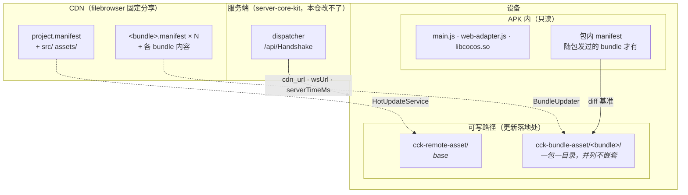
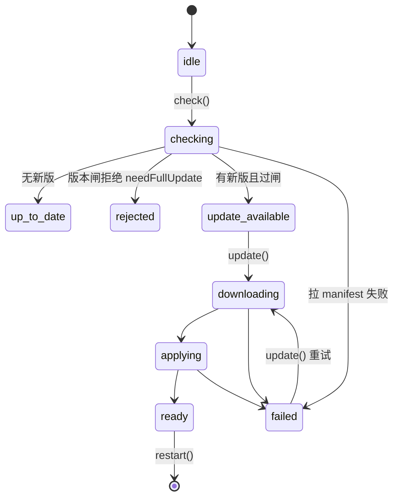
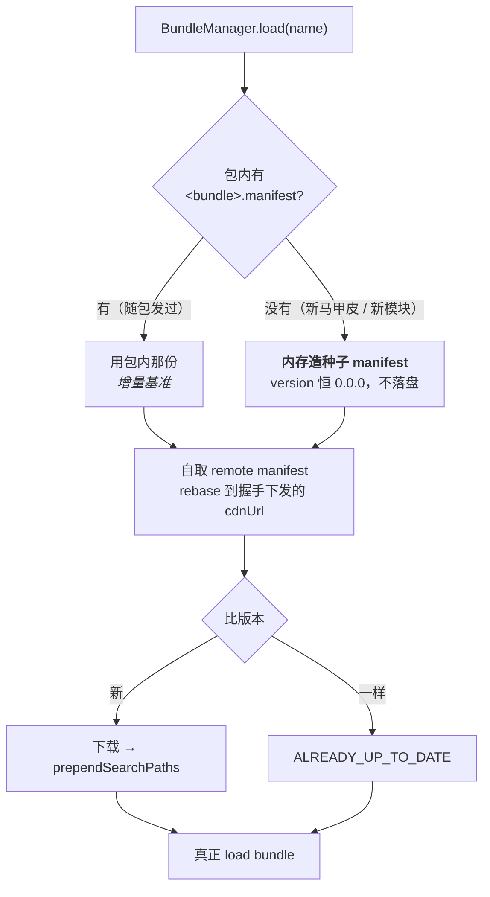

# demo 的热更流水线

## TL;DR

**两个独立更新目标**：base（AOT 那一层，改了要重启）与模块 bundle（免重启，加载前按需更新）。
**内容基址不烘在包里** —— dispatcher 握手下发 `cdn_url`，客户端自取 remote manifest、改掉地址
字段再灌回引擎。于是换 CDN / 灰度 / 挪域名只改服务端配置，不发新包。
**唯一还烘死在包里的地址是 `dispatcherUrl`**（链条起点，结构性救不了）。

## 三层更新边界

热更能覆盖多少，由「搜索路径还原发生在什么时候」这条时间线切死：

| 层 | 内容 | 能否热更 |
|---|---|---|
| **L0** 还原之前 | native `.so`（引擎 C++ + jsb 绑定）、`jsb-adapter/web-adapter.js`、**`main.js` 自身** | **不能**，只能发版 |
| **L1** 还原之后 · 需重启 | `src/`（含 `settings.json`）、`assets/main`、`assets/res`、`jsb-adapter/engine-adapter.js` | 能，`game.restart()` 生效 |
| **L2** 模块 bundle | 各功能 Asset Bundle | 能，**可不重启** |

落到实处：定时器 / Promise polyfill / DOM 垫片 / `WebSocket` / **`localStorage`** 出问题热更修不了
（`apply()` 靠 `localStorage` 存搜索路径 —— 存档机制自己不可热更）。
完整推导与 `cc.js` 跨 Creator 版本的坑见 [[hotupdate-service]]。

## 架构图



**一 bundle 一 storagePath 是硬约束**：引擎的 `MANIFEST_FILENAME` 硬编码为 `project.manifest`，
共用目录 = 各 bundle 的缓存 manifest 互相覆盖。

## 启动时序

```mermaid
sequenceDiagram
  autonumber
  participant App as Bootstrap / App
  participant DP as dispatcher
  participant HU as HotUpdateService
  participant BU as BundleUpdater
  participant CDN as CDN

  Note over App: 阶段 platform —— 读 app 戳（版本闸要的 appVersion / coreApiHash）
  App->>DP: 阶段 dispatch：握手
  DP-->>App: wsUrl · cdnUrl · serverTimeMs
  Note over App: cdnUrl 存进闭包 → 喂 ccHotUpdateModule<br/>同一步注册 BUNDLE_UPDATER（必须早于任何 load）

  App->>HU: 阶段 hotupdate：check()
  HU->>CDN: 取 remote project.manifest
  CDN-->>HU: manifest
  Note over HU: rebaseManifest 改三个地址字段<br/>loadRemoteManifest 灌回引擎
  alt 有新版本且过版本闸
    HU->>CDN: download（进度回调驱动启动界面）
    HU-->>App: ready → restart()，本轮启动就此中止
  else up-to-date / 闸拒绝
    HU-->>App: 继续
  end

  App->>BU: 阶段 shared：load 前 ensureLatest
  BU->>CDN: 每个包各查各的 <bundle>.manifest
  BU-->>App: 更新完成（免重启，此刻模块尚未加载）
  App->>App: load shared · skin-&lt;马甲&gt;-foundation · foundation
  Note over App: 地基跑 boot：协议 → 长连接 → 登录
  App->>App: 阶段 lobby → running
```

**地基必须排在 `hotupdate` 之后**，否则更新下来的要等下次启动才生效；长连接与认证跟着后移，
是这个排序的直接后果。

## base 更新的状态机



**闸跑在下载之前** —— 不兼容就不白下几十 MB，直接提示需整包更新。

## 分包更新：包内有没有 manifest 决定走哪条路



**种子的 `version` 恒 `0.0.0` 是硬约束**：`loadLocalManifest` 拿 local 与缓存 manifest 比版本，
local 更新时会把整个 storagePath 清掉 —— 种子恒最旧，缓存那份才能接管，第二次起自动变增量。
判据是「force-stop 冷启动零重下」。

**已下线模块的目录回收**：`pruneCcBundleStorage(keep)` 启动时对账一次，删掉不在名单里的目录。
名单由 app 给 —— native 侧没有权威来源可查「远端还发不发」，**名单为空会清光整个根**。

## 发一次版

```bash
cd apps/demo
node scripts/build.mjs boot --manifest --apk        # 出包：Creator 构建 → manifest → 同步 CDN → APK
node scripts/build.mjs boot --manifest --manifest-version 1.0.1   # 只更新 CDN（不出包）
```

`--manifest` 底层是 `packages/tools` 的 CLI：

```bash
node packages/tools/dist/cli.cjs \
  --root build/android/data --url <CDN base> --version 1.0.1 \
  --split --prev <上次发布目录> --out build/android/data
```

- `--split` 切成 base + 每个 bundle 一份 manifest；
- `--prev` 让**内容没变的包沿用旧版本号**。`build.mjs` 自动把它指向 `cdnDir`（当前线上那一版，
  此刻还没被同步覆盖），**不要手工绕开**——见下面那条 ⚠️；
- CDN base 取 filebrowser 的固定分享（`/api/public/dl/<hash>/`，hash 永久不变），见 skill
  `filebrowser-cdn`。

### 版本闸的两枚戳

`build.mjs` 每次构建自动打两枚，hash 由同一份 `packages/core/dist/index.d.ts` 算出，不等就当场抛：

| 戳 | 落点 | 时机 | 谁读 |
|---|---|---|---|
| **app 戳** `cck-app-compat.json` | `assets/resources/`（进包，归 base manifest） | Creator 构建**之前** | core `platform` 步 → `AppInfo` |
| **更新戳** `cck-update-compat.json` | `build/android/data/` 根 → CDN 根 | 跟 manifest 一起 | engine 后端拉 sidecar → `UpdateInfo` |

闸的判定：两端 `coreApiHash` 不等 → 拒并要求整包更新（`needFullUpdate`），不下载、不重启；
`--min-app-version <v>` 可再加一道「要求 app 版本 ≥ 此」。**单边缺失恒放行**——所以漏装会伪装成
"通过"，判据要看 `[App] app 戳未读到` 那行 warn 有没有出现，出现了就是闸在休眠。

⚠️ app 戳**只能放 `resources`**：`main` 只收被场景引用到的资源，散落的 JSON 会被丢掉；而
`shared` / `foundation` 是热更包，放那儿等于让模块级热更能改掉 app 自称的 hash，闸自己就废了。
`resources` 归 base manifest，跟 AOT 一起被 base 热更替换，戳因此永远描述"当前生效的那份 AOT"。

**⚠️ `--manifest` 必须夹在 Creator 构建与 gradle 之间**：Creator 每次清空 `data/`，gradle 又把
`data/` 整个塞进 APK。顺序错了 APK 里一个 manifest 都没有，且要装到机器上才报错。
已做进 `scripts/build.mjs`，别手工拆开跑。

**⚠️ 内容没变的包不许涨版本号——涨了客户端会 SIGSEGV。** 不是洁癖，是崩溃：
`AssetsManagerEx::prepareUpdateAsync` 把耗时的 diff 计算扔进 `AsyncTaskPool` 的 **worker 线程**，
任务体里遇 `diffMap.empty()`（资产表一致、只有版本号不同）就**就地** `updateSucceed()` 并
`dispatchUpdateEvent(UPDATE_FINISHED)`，绕开了本该把回调弹回主线程的 `prepareFinished`
（`performFunctionInCocosThread`）。于是 JS 回调在非主线程进 VM，`se::AutoHandleScope` 构造即
`SIGSEGV`。所以 `--prev` 是**必需项**，不是优化项。

**⚠️ 配 CDN 基址时 `200` 不等于拿到文件。** filebrowser 只在 `/api/public/dl/<hash>/` 下发文件，
其它任意路径都回 SPA 首页、状态码照样 200 → 客户端「下载成功」写下一坨 HTML，直到解析才炸
`readFile failed!`。**判据是 `Content-Type: application/octet-stream`。**

## 现状

| 能力 | 状态 |
|---|---|
| base 热更（native） | ✅ 真机 e2e PASS，含 force-stop 冷启动 |
| 分包热更（一 bundle 一 manifest，免重启） | ✅ 真机 e2e PASS |
| 内容基址听服务端下发（base + 分包统一） | ✅ 真机 e2e PASS，判据二值化：包内与 CDN 上所有 `packageUrl` 全烘死地址，唯一活地址是握手下发的 |
| 从没随包发过的 bundle（新马甲皮 / 新模块）自愈 | ✅ 种子 manifest，真机 PASS |
| 版本闸（`minAppVersion` / `coreApiHash`） | ⚠️ core 侧已实现并单测；**native backend 尚未透传 `coreApiHash`**，该字段的闸暂休眠 |
| Web / 小游戏远程 bundle 版本化 | ❌ 未实现（`IHotUpdateBackend` 接缝在，随需接） |
| 离线可进游戏 | ❌ 装了热更后端后，**热更服务器不可达 = 启动失败**（可重试）。要离线能进得把「检查失败」降级成「无更新」，属 core 启动序列的语义改动 |
| `dispatcherUrl` | 烘死在包里，链条起点，结构性救不了；出包时可由构建插件覆盖 |
