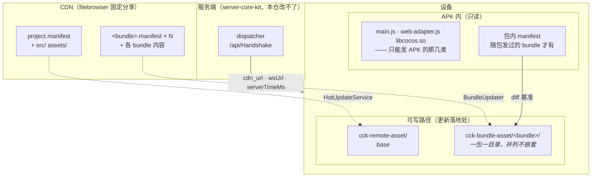
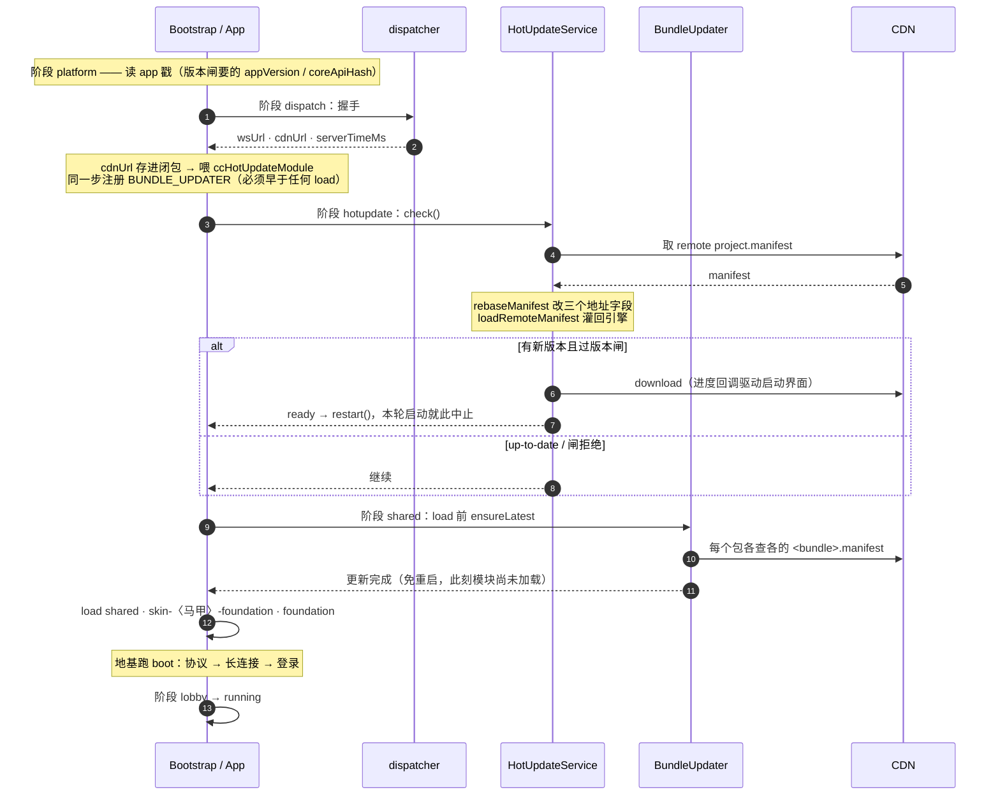
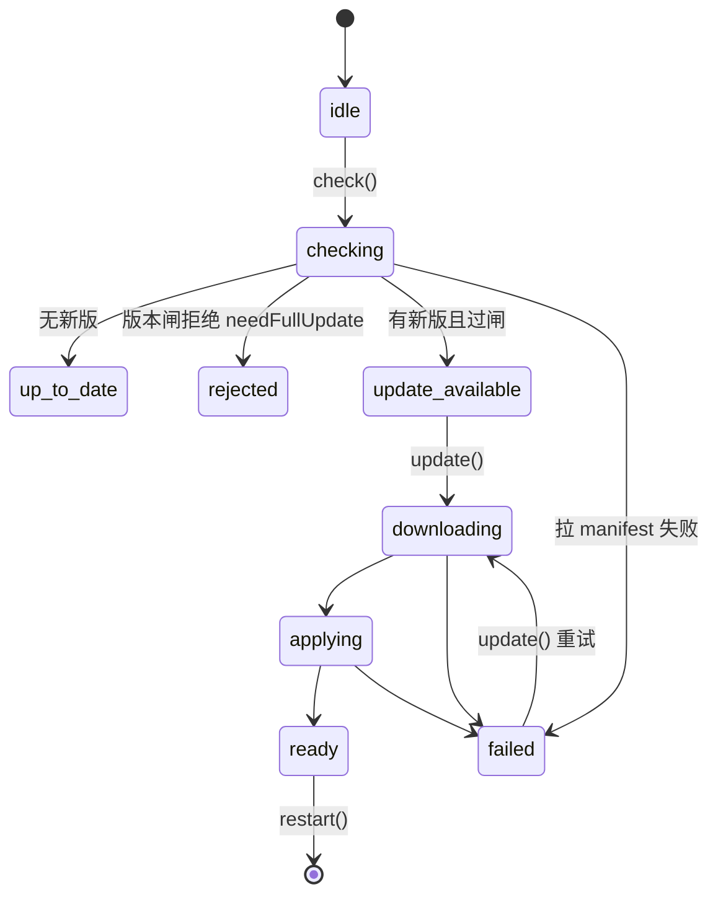
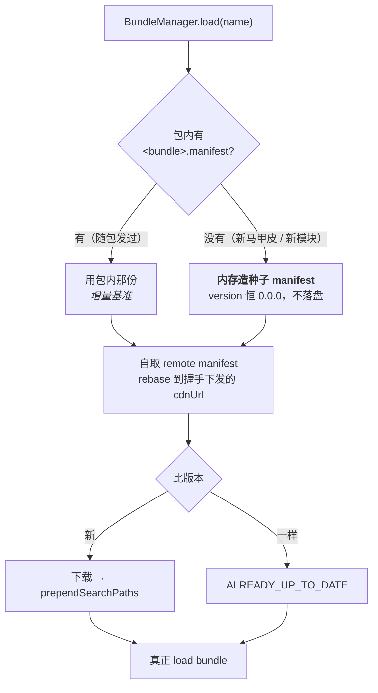
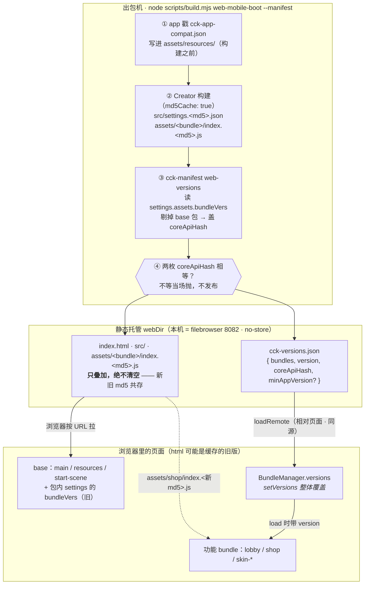
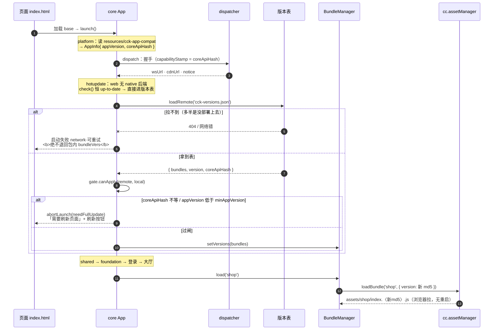
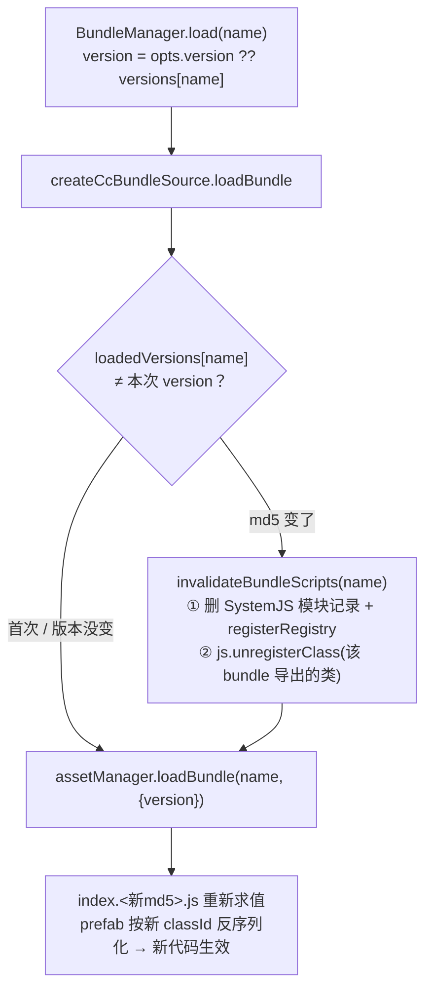

# demo 的热更流水线

## TL;DR

**两个独立更新目标**：base（base 那一层，改了要重启）与模块 bundle（免重启，加载前按需更新）。
**内容基址不烘在包里** —— dispatcher 握手下发 `cdn_url`，客户端自取 remote manifest、改掉地址
字段再灌回引擎。于是换 CDN / 灰度 / 挪域名只改服务端配置，不发新包。
**唯一还烘死在包里的地址是 `dispatcherUrl`**（链条起点，结构性救不了）。

> **这份文档只讲「demo 怎么把 kit 的热更装起来」** —— 真名、真路径、真命令、真机实证。
> 机制本身（`HotUpdateService` 的 API、状态机、闸策略、`IHotUpdateBackend` 契约、接入方必做项清单）
> 在 [[hotupdate-service]]，判据是「换一个接入方工程它要不要改」：那边不用改，这里基本要重写。
> 逐次 e2e 的完整实录属编年史，在 `docs/progress.md`。

## 更新边界：一次改动要付的三档代价

热更能覆盖到哪，由两条线切死：搜索路径的还原发生在什么时候，以及**谁的名字带 md5**
（产物开了 `md5Cache`，见 [[build-configs/README]]）。落到发版上只有三档：

| 代价 | 改到了什么 | 怎么下去 |
|---|---|---|
| **只能发 APK** | 引擎那一半 · 启动器自己 · 名字烘死在启动器里的那几个（下详） | **发不出去**：`cck-manifest` 的 `isEngineBound` 直接把它们剔出 manifest；万一从别的路子混进来，客户端的引擎指纹闸（`engineHash`）也拒收 |
| **热更下发，重启生效**（base） | `application.<md5>.js` → `settings.<md5>.json` → `src/chunks/bundle.<md5>.js` → `assets/{main,resources,internal}`。**全部业务代码和 `assets/boot` 都在这一档** | `project.manifest` 一份，启动期 check → 下载 → `game.restart()`（[[adr-0017]]） |
| **热更下发，不用重启** | 各功能 Asset Bundle：`foundation` / 业务模块 / 皮包 | 各自 `<bundle>.manifest`，`BundleManager.load` 之前按需更新（[[adr-0013]]） |

用户侧的那条分界线就是第一行与第二行之间：**base 改了热更下去、重启就生效；动到引擎指纹的只能发 APK。**

### 「只能发 APK」的三类，理由各不相同

| 这一类 | 具体是谁 | 为什么解不开 |
|---|---|---|
| **引擎的另一半** | `src/cocos-js/cc.<md5>.js`、`jsb-adapter/engine-adapter.js`、`src/effect.bin`（引擎 UBO 描述表，**不带 md5**） | 它跟 `libcocos.so` 里的 C++ 是同一次引擎构建切出来的两半，换 JS 不换 `.so` 崩在绑定层。这是**唯一一类真解不开的** —— 「引擎指纹变了才发 APK」这条判据说的就是它 |
| **启动器自己，和跑在它之前的** | `libcocos.so`、`jsb-adapter/web-adapter.js`、**`main.js` 自身** | 它们在搜索路径还原**之前**就跑完了，而 `main.js` 本身就是那段还原 —— 往热更目录里放一份新的，没有任何人会去读它 |
| **名字烘死在启动器里的** | `src/system.bundle.<md5>.js`、`src/polyfills.<md5>.js`、`src/import-map.<md5>.json` | 纯 JS、与 `.so` 无关（`system.bundle` 里 `jsb`/`native`/`cc.` 出现 0 次），技术上换得了；但 `main.js` 里 `require` 的是字面量旧 md5 名，新文件下下来没人念。**故意不解**：`import-map` 还兼任引擎身份凭据（`imports.cc`），解开它等于把唯一不可伪造的引擎身份也交给热更 |

> 2026-08-20 之前的文档与 ADR 把这几档记作 `L0` / `L1-E` / `L1-N` / `L1-A` / `L2`，指的是同一件事：
> `L0` + `L1-E` + `L1-N` = 只能发 APK，`L1-A` = base，`L2` = 模块 bundle。

## base 入口：base 能热更的全部机关

Creator 内置模板把 `application.<md5>.js` 的名字**烘死**在 `main.js` 里，热更下发的新 base 因此
没人念。但 `main.js` 是我们自己的（`build-templates/native/index.ejs`，官方覆盖点），而那句
`System.import` 跑在**搜索路径还原之后** —— 改成运行时解析就行：

```
main.js  ── 读 src/cck-base.json（固定名，随 base 热更）
            └─ { "application": "./application.<md5>.js" }
                 └─ settingsPath = src/settings.<md5>.json
                      ├─ scriptPackages = ../chunks/bundle.<md5>.js   全部业务代码
                      └─ bundleVers.{main,resources,internal}
```

出包时 `build.mjs` 在 Creator 构建之后、gradle 之前写这份指针，并把根上的入口用 `--files`
喂给 manifest（子目录遍历够不着产物根）。三道兜底，任何一道触发都**退回包内 base** 而不是抛
——黑屏是最坏结果，退回还能起来、下一轮 check 会重下：指针读不到 / 不是合法 JSON / 指向的
文件不存在（半更新）。出包侧另有一道硬闸：`project.manifest` 里没有入口或没有指针就构建失败，
否则「base 热更静默失效」——构建全绿、下发成功、玩家跑的还是包内旧代码。

## 启动看门狗：base 起不来时退回包内

三道兜底管的是「指针指不到东西」；管不了「指针指到了、文件也在、**但那份 base 起不来**」——
引用了这个引擎没有的符号、文件半损、某类机型上崩。那一刻 `System.import` 抛在 `main.js` 的
catch 里，而作废缓存的代码在 Bootstrap 里，**永远轮不到**。实测：连续冷启动逐字相同，
**覆盖装另一个 APK 也救不了**，只有清应用数据。这是 base 解锁引进来的唯一一种玩家自己救不回来
的失败（[[adr-0018]]）。

`main.js` 因此还带一个计数器：

```
决定用热更 base → cck.baseTry +1（落盘在 System.import 之前）
起来了         → Bootstrap 的 resetCcHotUpdateOnAppChange() 清 0    ← 「起得来」的握手
连续 2 次没清  → 隔离：这一次不还原搜索路径、不认指针、跑包内 base
                 + resetCcHotUpdateOnAppChange() 先把那一版的版本号记进 cck.baseBadVersion，
                   再把两个缓存根整个删掉
之后           → base 的 check() 见到同号直接当 up-to-date（不再重下，否则三步一轮地振荡）
发布方发新号   → 号不匹配了 → 清掉标记 → 正常下载 → 自动恢复
```

握手点定在 Bootstrap 早期是有意的：跑到那儿就证明 base 加载成功、cc 初始化完、场景在跑；再往后
的失败（网络、登录）不算 base 的账 —— 放得更晚会让一次断网变成「回滚 base」。

**版本号由 engine 一侧读、不在 `main.js` 里读**：它写在缓存那份 `project.manifest` 里，而那个
目录是可配的（`CcHotUpdateOptions.storagePath`）；`main.js` 只够得着硬编码的键，接入方改过路径
就会读空 → 记不下 → 拦不住重下 → 照样振荡。

**只挡 base，不挡分包。** base 与分包共用同一个 `--version`，`--prev` 下内容没变的分包还沿用
旧号 —— 拿 base 的隔离结论去挡，会把一批分包永久钉死在包内版本。分包与包内 base 兼不兼容自有
`coreApiHash` 闸管，那正是它的活。

⚠️ `cck.baseTry` 的字面量在 `index.ejs` 与 `packages/engine/src/hotupdate-backend.ts` 里**各写一份**
（`main.js` 跑在 SystemJS 之前，import 不到 TS 侧的常量），和 `HotUpdateSearchPaths` 是同一类约束
—— 区别是它有闸：`build.mjs` 出包时对一次两边的字面量，漏改一处当场失败。

**base manifest 因此装的是 base 整条链**（实测 21 项：入口 + 指针 + settings + chunks +
`assets/{main,resources,internal}`），「只能发 APK」那三类一个都不发。`assets/boot` 从「发新包、重启」
变成「热更、重启」；仍要能**不打断玩家**地热修的逻辑照旧放 `foundation`（免重启），见 [[bundle-layout]]。
引擎指纹变才回到「必须发 APK」。

⚠️ **`assets/internal` 结构上在 base 这一档，实践上跟引擎走。** 两半都实测过：
① 它的资源集合与 `settings.engine.builtinAssets` **双向完全相等**（各 20 项），由**引擎模块开关**决定
而不是场景用了什么 —— demo 从没用过 spine，但 `engine.json` 里 `spine`/`spine-3.8`/`dragon-bones` 开着，
`builtin-spine` + `default-spine-material` 照样进包；`3d` 关着，`builtin-standard` 就不在。
② **工程引用的 `db://internal` 资源不进 internal**，走的是普通 bundle 归属规则 —— 而那条规则会漂，
见下节。
⇒ **internal 变 ⟺ 引擎模块变 ⟺ `cc.<md5>.js` 变 ⟺ 引擎指纹闸拦成整包更新**。它在 base manifest 里，
但**成本为零**：引擎没变时逐字节相同、不产生 diff；引擎变了整个更新早被闸拒成「发 APK」。
留着它只为让 `settings.bundleVers.internal` 指向的目录一定在本地。
`src/effect.bin` 连结构上都不算 base：5.7 KB zlib 解压出 256 KB，全是 `cc_matView` ×324、
`cc_fogColor` ×80 这类**引擎 UBO / descriptor 布局**，不含任何 effect 名，跟工程内容无关；且它
**固定名无 md5**，一旦下发会直接破坏内容寻址的 immutable 缓存。两条理由各自都够，`isEngineBound`
里单列了它。

## 资源归属：一个共享仓，别的都不许借

Creator 把**被多个 bundle 引用的资源判给优先级最高的引用者**，其余包降级成 `cc.config` 的
`deps` + `redirect`（「去那个包拿」）。归属因此随引用关系漂移，而漂移**静默**：构建全绿、
manifest 正常、热更下发成功，直到运行时在 `redirect` 指向的包里找不到资源。

demo 的 2026-08-20 产物里两种漂法都出过：

| 漂法 | 实况 | 后果 |
|---|---|---|
| **漂进 base** | `boot`（→`main`，priority 7）与 6 个皮包共用 `default_btn_normal` → 图归 `main`，皮包 `deps:["main"]` | `main` 归 base：改它要热更 base 并**重启**，而皮包免重启、先到一步 —— 中间那段窗口里皮包引用的 uuid 在旧 `main` 里不存在，界面一开就挂。**改的还不是那个皮包，是 boot** |
| **跨马甲漂** | 两个马甲的地基皮包同为 priority 2、都引用它 → Creator 挑了 `skin-default-foundation` | `skin-vest-lobby`/`skin-vest-mail` 依赖 **default 马甲**的包，马甲隔离破掉 |

优先级（`.meta` 的 `userData.priority`）：`resources` 8 > **`main` 7**（Creator 内置）>
`foundation` 6 > `shared` 5 > `lobby` 3 > 地基皮包 2 > 其余 1。抬高 `foundation`/`shared` 去压
`main` 会把 base 框架拉进热更包，[[adr-0014]] 已经否掉了 —— 所以压不过 `main`，只能绕开它。

**规则（硬）**：

1. **一个包能当共享仓，条件是它的 priority 严格高于所有引用者** —— 同级会被抢（上表第二行：两个
   马甲的地基皮包同为 2，Creator 挑了 base 那个）。所以**共享仓可以有多个**：跨模块共用的图集 /
   字体放地基皮包（2 > 模块皮包 1）合法，`shared`(5) 对业务包也合法。
2. **不属于工程任何包的外部资源（`db://internal` —— 工程里没有对应 `.meta`）没有天然归属**，谁引用
   就判给优先级最高的那个引用者 → 会漂进 `main`（上表第一行）。这类**必须钉**：用到的每个都在
   `assets/resources/internal-pin.prefab` 里挂一个节点引一次。`resources` priority 8 是工程里最高
   的，归属被它吸走后谁也抢不动 —— **工程各处照常引用 `db://internal`，一行都不用改**，也不产生
   副本字节。加新内置图 = 往钉子里加一个节点。
3. **产物闸认的是共享仓白名单**，默认只有 `resources` —— demo 眼下也确实只有这一个（`assets/shared/`
   里目前只有一个 json，没有共享美术）。多开一个仓就得声明：`--allow-deps skin-default-foundation`，
   否则 `skin-default-lobby deps:["skin-default-foundation"]` 会被当成漂移拒发。
4. 钉进 `resources` 的那些跟 base 同寿命 —— base 能热更之后这意味着「加一张内置图要热更整个 base
   并重启」，不再是发 APK。

**两道闸**（判据与分工见 [[bundle-deps]]）—— 都只管**资源**边；跨包 `import` 归另一条规则，
见 [`bundle-layout.md`](bundle-layout.md#依赖拓扑与防环)：

- **源码期** `pnpm check:pins`（= `cck-manifest check-pins --assets apps/demo/assets`）——
  不用构建。`assets/` 下任何资产引用的 uuid，只要不属于本工程（没有对应 `.meta`），就必须也被
  `resources/` 里的资产引用一次，否则报出 uuid + 引用它的文件列表并 `exit 1`。
- **产物期** `cck-manifest --split` 写 manifest 之前扫 `assets/*/cc.config*.json` 的
  `deps`/`redirect`，指向共享仓以外的任何包一律拒发（`--allow-deps` 可声明别的仓名）。

产物期那道**会漏一类**：一个外部资源只被**一个**包引用时不产生 `deps`，当场看不出问题，等哪天
第二个包也用它才漂 —— 源码期那道要求「引用即钉」，把这类提前拦住。反过来工程自有资源在多个
可热更包之间共用时 uuid 不算「外部」，只有产物期看得见，所以两道都要有。

钉上之后的产物：`resources` 自有 7 项，`native/` 下是**原 internal uuid** 的两张 png
（`20835ba4-….90cf4.png` / `7d8f9b89-….cea68.png`）；`main` 自有从 8 项降到 3 项；
**所有跨包资源依赖都指向 `resources`**（demo 眼下只有这一个共享仓），跨马甲依赖清零。

⚠️ **app 戳 `assets/resources/cck-app-compat.json` 随 base 一起热更**，因此它描述的是「当前跑的
这套代码的身份」，不是「这个 APK 的身份」。这是**必须**的：热更换掉 `chunks/bundle.js` 就是换掉了
core，戳若冻在 APK 上，`coreApiHash` 闸会开始拒绝本来正确的模块更新。真正不可伪造的那一端是
**引擎指纹** —— `AppInfo.engineHash` 运行时取自 SystemJS import map（名字烘死在 `main.js` 里，热更够不着）。
同理「APK 换没换」也不能再问 `settings.bundleVers`（它现在会随热更翻，会把刚下好的缓存删掉、
死循环），改问 `main.js` 烘进来的 `window.__cckBaseEntry`。

落到实处：定时器 / Promise polyfill / DOM 垫片 / `WebSocket` / **`localStorage`** 出问题热更修不了
（`apply()` 靠 `localStorage` 存搜索路径 —— 存档机制自己不可热更）。
完整推导与 `cc.js` 跨 Creator 版本的坑见 [[hotupdate-service]]。

## 架构图



**一 bundle 一 storagePath 是硬约束**：引擎的 `MANIFEST_FILENAME` 硬编码为 `project.manifest`，
共用目录 = 各 bundle 的缓存 manifest 互相覆盖。

## 启动时序



**地基必须排在 `hotupdate` 之后**，否则更新下来的要等下次启动才生效；长连接与认证跟着后移，
是这个排序的直接后果。

## base 更新的状态机



**闸跑在下载之前** —— 不兼容就不白下几十 MB，直接提示需整包更新。

## 分包更新：包内有没有 manifest 决定走哪条路



**种子的 `version` 恒 `0.0.0` 是硬约束**：`loadLocalManifest` 拿 local 与缓存 manifest 比版本，
local 更新时会把整个 storagePath 清掉 —— 种子恒最旧，缓存那份才能接管，第二次起自动变增量。
判据是「force-stop 冷启动零重下」。

**已下线模块的目录回收**：`pruneCcBundleStorage(keep)` 启动时对账一次，删掉不在名单里的目录。
名单由 app 给 —— native 侧没有权威来源可查「远端还发不发」，**名单为空会清光整个根**。

## 发一次版

```bash
cd apps/demo
node scripts/build.mjs boot --manifest --apk        # 出包：Creator 构建 → manifest → 同步 CDN → APK
node scripts/build.mjs boot --manifest --manifest-version 1.0.1   # 只更新 CDN（不出包）
```

**CDN 是叠加式的，只叠加、绝不清空**（与 web 同理，与开 `md5Cache` 之前相反）：文件名带 md5，
历史各版本的字节留在 CDN 上正是「回滚只换 manifest」成立的前提。每次发布顺手把这一版的
manifest 归档进 `releases/<version>/`，同时写一份 `source.json` 记**出处**。

### 从崩溃堆栈回到代码

后台那条崩溃里的文件名带产物指纹（`assets/main/index.f8c7f.js`）—— **指纹逐包，比整体版本号准**，
因为各分包是各自独立热更的。两步定位：

```bash
grep -rl "index.f8c7f.js" <cdnDir>/releases/    # ① 哪一版
cat <cdnDir>/releases/<那一版>/source.json      # ② 那一版是哪个 commit
```

`source.json` 由出包流程写，长这样；`dirty` 为真表示那次是带脏工作区出的包，**commit 号本身不足以
复现产物**：

```json
{ "version": "1.4.0", "commit": "<40 位 sha>", "branch": "feat/platform-sdk",
  "dirty": false, "builtAt": "...", "vest": null, "channel": "qq" }
```

只 native 写。web 那条链没有 `releases/` 目录、也还没有崩溃上报，不提前发明。
**从行号回到源码行还差一步**（sourcemap 归档与还原，尚未实现，见 hlgit #54）。

### 回滚

```bash
# 号必须比当前在发的大，否则客户端判 up-to-date、回滚无声失败
node ../../packages/tools/dist/cli.cjs rollback --cdn <cdnDir> --release 1.0.1 --version 1.0.3
```

它把 `releases/1.0.1/` 的 manifest 配上更大的号发回 CDN 根，**内容文件一个都不用重传**。

- **⚠️ 版本号只增，别去注入 `setVersionCompareHandle`。** 引擎默认 `cmpVersion` 会把「远端号更小」
  判成本地已最新，看起来注入「不等即更新」就解决了——**那是陷阱**：同一个 handle 还服务
  `loadLocalManifest` 的 `versionGreater`（包内 manifest 比缓存新 → 清掉旧热更缓存），
  改了会让**新装的 APK 永远被上一版热更缓存盖住**。
- **⚠️ 只有内容真变了的包才涨号**（`rollback` 已自动比对）。给没变的包也涨号 = 客户端判
  NEW_VERSION、`genDiff` 却是空表 → worker 线程 SIGSEGV，与下面 `--prev` 那条是同一个坑。

`--manifest` 底层是 `packages/tools` 的 CLI：

```bash
node packages/tools/dist/cli.cjs \
  --root build/android/data --url <CDN base> --version 1.0.1 \
  --split --prev <上次发布目录> --out build/android/data
```

- `--split` 切成 base + 每个 bundle 一份 manifest；
- `--prev` 让**内容没变的包沿用旧版本号**。`build.mjs` 自动把它指向 `cdnDir`（当前线上那一版，
  此刻还没被同步覆盖），**不要手工绕开**——见下面那条 ⚠️；
- CDN base 取 filebrowser 的固定分享（`/api/public/dl/<hash>/`，hash 永久不变），见 skill
  `filebrowser-cdn`。

### APK 覆盖安装 / 降级安装

`Bootstrap` 在 `bootCoreKit` **之前**调 `resetCcHotUpdateOnAppChange()`，它同时兼三件事：
**清看门狗计数**（跑到这一行就证明这套 base 起得来）、**认 APK 换没换**、**执行隔离态的作废**。
后两者任一成立就把 `cck-remote-asset/` + `cck-bundle-asset/` + `<base>_temp/` 整个删掉，从头再更新一遍。

判「APK 换没换」用的是**包内 base 入口的 md5**（`main.js` 挂上来的 `window.__cckBaseEntry`），
**不是** `settings.bundleVers.main`：base 现在可热更，那个每更新一次就翻一次，会把刚下好的缓存
当成「上一版 APK 的」删掉，死循环。没开 `md5Cache` 时入口就叫 `application.js`、抠不出 md5 →
判不了 → 原样不动（当成「换了」会让每次冷启动全量重下）。所以**一次纯热更不触发这段**，
只有真装了另一个 APK 才触发。

要这段是因为引擎自带的 `versionGreater` 只在版本号纪律成立时有效——装了**更旧**的包时包内号更小、
缓存反而接管，而 `coreApiHash` 闸此时不会跑（缓存 = 远端 → check 判 up-to-date → 不拉 sidecar）。
少了它，表现就是「装完新包启动报错，清数据才好」。

### 版本闸的两枚戳

`build.mjs` 每次构建自动打两枚，hash 由同一份 `packages/core/dist/index.d.ts` 算出，不等就当场抛：

| 戳 | 落点 | 时机 | 谁读 |
|---|---|---|---|
| **app 戳** `cck-app-compat.json` | `assets/resources/`（进包，归 base manifest） | Creator 构建**之前** | core `platform` 步 → `AppInfo` |
| **更新戳** `cck-update-compat.json` | `build/android/data/` 根 → CDN 根 | 跟 manifest 一起 | engine 后端拉 sidecar → `UpdateInfo` |

更新戳还多一枚 **`engineHash`**（`cc.<md5>.js` 的那段 md5，`--root` 从产物 `src/import-map*.json` 读）。
app 戳里**没有**它 —— app 戳生成于 Creator 构建之前、那时产物还不存在；客户端那一端由 engine 的
`engineHash()` 运行时从 SystemJS import map 取。两端比对挡住「热更来的 JS 配上另一个引擎」，
这是 `coreApiHash` 够不着的一层（换 Creator 版本 / 改引擎模块勾选时 `coreApiHash` 一动不动）。

闸的判定：两端 `coreApiHash` 不等、或两端 `engineHash` 不等 → 拒并要求整包更新（`needFullUpdate`），不下载、不重启；
`--min-app-version <v>` 可再加一道「要求 app 版本 ≥ 此」。**单边缺失恒放行**——所以漏装会伪装成
"通过"，判据要看 `[App] app 戳未读到` 那行 warn 有没有出现，出现了就是闸在休眠。

⚠️ app 戳**只能放 `resources`**：`main` 只收被场景引用到的资源，散落的 JSON 会被丢掉；而
`shared` / `foundation` 是热更包，放那儿等于让模块级热更能改掉 app 自称的 hash，闸自己就废了。
`resources` 是 base 包、被 `--md5` 排除出 base manifest → **戳不可能被热更改动**，它严格等于「这个 APK 的身份」，闸的这一端因此不可伪造。

**⚠️ `--manifest` 必须夹在 Creator 构建与 gradle 之间**：Creator 每次清空 `data/`，gradle 又把
`data/` 整个塞进 APK。顺序错了 APK 里一个 manifest 都没有，且要装到机器上才报错。
已做进 `scripts/build.mjs`，别手工拆开跑。

**⚠️ 内容没变的包不许涨版本号——涨了客户端会 SIGSEGV。** 不是洁癖，是崩溃：
`AssetsManagerEx::prepareUpdateAsync` 把耗时的 diff 计算扔进 `AsyncTaskPool` 的 **worker 线程**，
任务体里遇 `diffMap.empty()`（资产表一致、只有版本号不同）就**就地** `updateSucceed()` 并
`dispatchUpdateEvent(UPDATE_FINISHED)`，绕开了本该把回调弹回主线程的 `prepareFinished`
（`performFunctionInCocosThread`）。于是 JS 回调在非主线程进 VM，`se::AutoHandleScope` 构造即
`SIGSEGV`。所以 `--prev` 是**必需项**，不是优化项。

**⚠️ 配 CDN 基址时 `200` 不等于拿到文件。** filebrowser 只在 `/api/public/dl/<hash>/` 下发文件，
其它任意路径都回 SPA 首页、状态码照样 200 → 客户端「下载成功」写下一坨 HTML，直到解析才炸
`readFile failed!`。**判据是 `Content-Type: application/octet-stream`。**

## web 那条路（同一道闸，完全不同的机制）

native 的一切都围绕「怎么把文件下下来」；**web 一个文件都不用下** —— 引擎按
`assets/<bundle>/index.<md5>.js` 取，浏览器自己会拉。于是整条流水线只剩一张表：

| | native | web |
|---|---|---|
| 产物 | 一 bundle 一份 manifest（每文件 md5+size） | **一张版本表** `cck-versions.json`（bundle → md5） |
| 谁下载 | `AssetsManagerEx` 自己下 | 浏览器（换文件名即换版本） |
| 基址 | dispatcher 下发 `cdn_url`，运行时注入 | **不需要** —— 版本表与 bundle 同源，跟着页面走 |
| 部署 | **只叠加、绝不清空** + 归档 `releases/<version>/`；**引擎层不拷** | **只叠加、绝不清空**（引擎 JS 就是页面要跑的，照拷） |
| 生效 | base 要重启；模块包免重启 | 免重启（下次 `load` 就是新的） |
| bundle 版本 | 从**刚更新完的那份 manifest** 反推（`bundleVersionFromAssetKeys`） | 版本表 `cck-versions.json` |
| 回滚 | `cck-manifest rollback`（换 manifest，不重传内容） | 换版本表（旧 md5 文件还在） |
| 版本闸 | 两枚戳（app 戳 + 更新戳） | app 戳 + **版本表里的 `coreApiHash`** |
| 检查失败 | base 与分包**一律中止**·可重试 | **一律中止**·可重试（表与页面同源，缺它 = 没部署上去） |

### 架构图（出包 → 托管 → 页面）



`cck-versions.json` 是整条链上**唯一**的热更产物：没有 manifest、没有 `packageUrl`、没有逐包版本号。

### 启动时序（闸在哪一步）



**闸摆在 `setVersions` 之前**：不兼容就一个新 bundle 都不装 —— 否则新代码 call 到 base 里已被裁掉的
符号，要跑到那一行才崩。

### 免重启换代码的内幕（`engine/bundle-source.ts`）



模块记录与类注册**必须一起清**：只删模块 → `js.setClassName` 撞名不覆盖 `_registeredClassIds`，
prefab 仍按旧 classId 反序列化，表现为「类换了、界面没换」；只注销类 → `System.import` 命中缓存、
declare 不再执行，反序列化报 `Can not find class`、组件被静默丢弃。
**⚠️ 版本没变时绝不能清**：引擎按 URL 缓存已下载脚本，清了那段代码就再也执行不到，下次 load 直接失败。

### 发一次版

```bash
cd apps/demo
node scripts/build.mjs web-mobile-boot --manifest                          # 构建 → 版本表 → 叠加部署
node scripts/build.mjs web-mobile-boot --manifest --manifest-version 1.0.1
```

底层是 `cck-manifest web-versions`（详见 [[web-versions]]）。落点由 `local.json` 的 `webDir` 决定
（本机是 filebrowser 的 8082 静态口，见 skill `filebrowser-cdn`）。

**⚠️ 部署只叠加、绝不清空。** 老页面还在引用上一版的 `index.<旧md5>.js`，删了它们等于把线上正在
跑的会话打断。文件名带 md5、新旧天然共存，「免重启换代码」正是靠这个（[[adr-0010]]）。
这条和 native 相反，别把那边的 `rmSync + cpSync` 抄过来。

**⚠️ `md5Cache` 必须开。** 关着它 `bundleVers` 是 `{}`，web 根本没有版本可言 —— 换文件名就是它的
版本机制。`web-mobile-boot.json` 里已经开了；生成版本表时会当场报错点名这一项。

**⚠️ 版本表**不要**去拼 dispatcher 下发的 `cdnUrl`。** 那是 native 的解法（APK 里烘死的地址改不了，
只能运行时注入）；web 上页面自己就是从某个地址加载的，相对路径永远跟着页面走。硬拼过去只会
拿到跨域拒绝或 404 —— 本机实测就是 `8082` 的页面去拉 `8081` 的版本表，CORS 直接拦掉。
所以 `APP_CONFIG.versionUrl` 写**相对文件名**，且 native 明确不配（那条压根没有 bundleVers 这回事）。

**版本表的价值在于绕过 html 缓存。** 改任何一个 bundle 都会连带改掉 `index.html`（bundleVers 变 →
settings 的 md5 变 → application.js 变 → html 引用变），所以玩家手里那份 html 可能是缓存的旧版；
版本表用 no-store 拉、永远最新，旧页面因此也能加载新 bundle。此时 base 仍是旧的 —— 正是
`coreApiHash` 闸要挡的情况：新 bundle 要新 base 时拒掉，让玩家刷新拿整包。

**⚠️ 拉不到版本表 = 启动失败（可重试），不退回包内 `bundleVers`。** 表与页面**同源**：页面都跑起来了
却少这一个 json，几乎只有一种解释 —— 它没被部署上去，属发布事故。静默降级会把事故伪装成「玩家在玩
旧版」，线上无人察觉；且叠加部署一旦清过历史版本，包内 `bundleVers` 指向的 md5 可能已 404，降级只是
把失败推迟到 `load` 时、报错更难查。

同一条判断贯穿三条路径（[[adr-0015]]，推翻了 ADR-0013 决策 6 的「永不 reject」）：

| 路径 | 检查 / 下载失败时 |
|---|---|
| native base（`HotUpdateService.check`） | **中止启动**·可重试 |
| native 分包（`BundleUpdater.ensureLatest`） | **中止**：启动期 → 启动失败页·可重试；运行期 → 打开模块失败 |
| web 版本表 | **中止启动**·可重试 |

分包唯一的 no-op 是**平台没注册热更后端**（web / 编辑器）—— 那不是失败，是这条路不存在。
版本闸拒绝另有分类：带 `needFullUpdate` 标记（该发整包了），UI 引导去商店，而不是让玩家对着
「重试」徒劳点。

协议层面的「客户端太旧」不归它管：那是 `dispatch` 步握手时服务端按 `appVersion` / `capabilityStamp`
判的（`action: update` → `needFullUpdate`），**排在版本表之前**；而包内 base 与包内 bundle 本就是同一次
构建的产物，天然配套，不存在「新 base 配旧 bundle」的错配。

## 真机验证：每条都做成二值判据

模拟器上的实录是编年史（在 `docs/progress.md`），这里只留**判据** —— 每条 e2e 为什么能证明它想证明的事。
共同前提：全程无 `F/libc` / `F/DEBUG`。

| 验的是 | 判据（为什么这条能证明） |
|---|---|
| base 热更真的接管了 | `am force-stop` 后**全新 PID** 仍是新版。`game.restart()` 是同进程，内存里的 `setSearchPaths` 还在 —— 漏掉启动还原也照样是新版，验不到 |
| 分包免重启 | `BUILD_TAG` 全程没翻（base 没换）而 `SHOP_TAG` 翻了；且只下那一个变更文件（271 字节） |
| 分包不靠启动还原 | 断开托管后冷启动仍是新版，且 `localStorage` 里**确无** `HotUpdateSearchPaths` → 只可能来自 `create()` 时 C++ 的 `prependSearchPaths` |
| 基址真的来自服务端 | **包内与 CDN 上所有 `packageUrl` 全烘成死地址** `http://127.0.0.1:9/dead/`，全局唯一活地址是握手下发的 —— 能下成功就只可能来自运行时改写。对照组（改动前的 engine）报 `ConnectException: /127.0.0.1:9` |
| 真下载而不是 up-to-date | 往 `foundation` 埋一句包内不存在的日志：`unzip -p …apk assets/assets/foundation/index.js | grep -c` = **0**，设备缓存里同 grep = **1** |
| 新增 bundle 自愈 | APK 里根本没有 `skin-vest-*`，首次全量下 3 个文件；force-stop 冷启动只发 4 个 `*.version.manifest` 探测、**一个资源都没重下** → 种子 `0.0.0` 让缓存 manifest 接管了 |
| 版本闸真的在拦 | 同一个 APK 二分：远端戳 hash = app 侧 → 下载并重启；改成 `deadbeefcafe` → `rejected(needFullUpdate)`，不下载不重启 |
| 看门狗只挡 base | 让 `foundation.manifest` 与被隔离的 base **同为 1.3.2**：`grep -c "起不来被隔离过"` = **1**（只有 base），foundation 照常 check 并重下 |
| 下线目录回收不误删 | 手植 `cck-bundle-asset/arena/` + `arena_temp/` → 回收 2 个，而 `shop/` 与 `shop_temp/` 还在、`SHOP_TAG` 未退版；再冷启动回收 0 个（幂等） |

## 现状

| 能力 | 状态 |
|---|---|
| base 热更（native） | ✅ 真机 e2e PASS，含 force-stop 冷启动 |
| **base 热更（native，重启生效）** | ✅ 真机 e2e PASS（[[adr-0017]]）：固定名指针 `src/cck-base.json` → 热更下发的 `application.<md5>.js` 接管，force-stop 冷启动仍是新版 |
| **base 启动看门狗**（下发的 base 起不来时退回包内并隔离那一版） | ✅ 真机 e2e PASS（[[adr-0018]]）：坏 base 死两次 → 第三次跑包内 + 作废缓存 + 记下坏版本号；发新号自动恢复；**只挡 base 不误伤同号分包** |
| 分包热更（一 bundle 一 manifest，免重启） | ✅ 真机 e2e PASS |
| 内容基址听服务端下发（base + 分包统一） | ✅ 真机 e2e PASS，判据二值化：包内与 CDN 上所有 `packageUrl` 全烘死地址，唯一活地址是握手下发的 |
| 从没随包发过的 bundle（新马甲皮 / 新模块）自愈 | ✅ 种子 manifest，真机 PASS |
| 版本闸（`minAppVersion` / `coreApiHash`） | ✅ 两端都接上了（native 两枚戳 / web 版本表带 hash），真机与浏览器**双向 e2e**：改 hash 即拒、恢复即放行 |
| web 远程 bundle 版本化 | ✅ 版本表 + `setVersions`，浏览器 e2e PASS：**旧页面加载新 bundle 代码**、整页未重载 |
| 小游戏（微信 / 抖音） | ❌ 未验。机制与 web 同（版本表 + md5 文件名），差在各家自己的分包/缓存规则 |
| 离线可进游戏 | ❌ 装了热更后端后，**热更服务器不可达 = 启动失败**（可重试）。要离线能进得把「检查失败」降级成「无更新」，属 core 启动序列的语义改动 |
| `dispatcherUrl` | 烘死在包里，链条起点，结构性救不了；出包时可由构建插件覆盖 |
