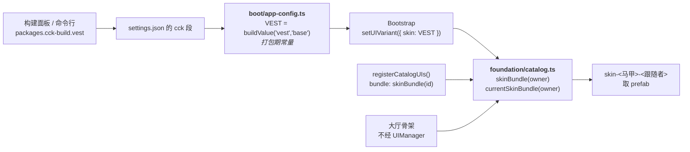
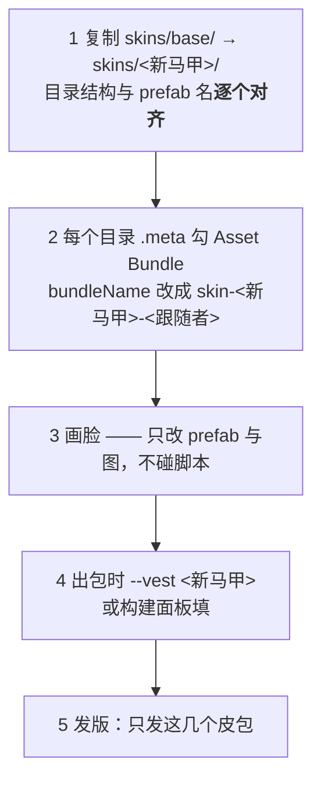

# 马甲与换皮

## TL;DR

**马甲 = 同一套逻辑的不同发行版**（不同的脸、不同的 `appId`、可以连不同的服）。
登记了换皮的界面，prefab **一律**从 `skin-<马甲>-<跟随者>` 包取，**原层里不留脸**。
脚本仍归原层（地基 6 / 模块 1），皮包里只有 prefab 与图。
出一版新马甲 = **只发它自己那几个皮包**，地基与模块一个字不动。

## 接缝图

两条路进同一个接缝：

- **经 UIManager 的界面** —— `MODULE_CATALOG` 里写 `skinned: true`，`registerCatalogUIs()`
  把 `bundle` 登记成 `skinBundle(id)`；大厅负责把皮包跟模块包**一起装卸**。
- **不经 UIManager 的界面**（大厅骨架）—— 自己调 `currentSkinBundle('lobby')` 加载。
  它随 `Lobby.scene` 生死、不进层容器、不参与 open/close，塞进 UI 注册表只会让
  `listUIDefs()` 多两个永远不会被 open 的条目。

**换皮界面不许用 `@property(Prefab)`** —— 那是编辑器期绑定，会把 prefab 绑死在自己 bundle 里。

## 皮包边界：一个跟随者一个皮包

**皮的分包边界 = 它跟随者的分包边界**，于是加载时机自动对齐：

| 皮包 | 跟着谁 | 什么时候在内存里 | priority |
|---|---|---|---|
| `skin-<马甲>-foundation` | 地基层（登录，以后的公告 / 强更提示） | 启动期随 `shared` 装，常驻 | 2 |
| `skin-<马甲>-lobby` | `modules/lobby` | 进大厅时装，常驻 | 1 |
| `skin-<马甲>-<模块>` | `modules/<模块>` | 打开该模块时装，关闭时卸 | 1 |

**不许一个马甲一个大皮包**：那样启动就得把玩家永远不点的模块的脸一起下下来，也算首包体积、
也算流量，改一张脸还要重下整包。

**跨模块共用的图集 / 字体放地基皮包**（priority 2 高于模块皮包 1，归属唯一），
否则各模块皮包各复制一份。

demo 当前给**登录、大厅骨架、邮件**登记了换皮；商城与两个小游戏没登记，脸留在自己的模块包里、
所有马甲同一张。

## 加一个马甲

要点：

- **同名同路径**。`skinBundle` 只换 bundle 名、不换 prefab 路径 —— `login/Login`
  在每个马甲的地基皮包里都得叫这个。
- **每个马甲都得有对应皮包和里头的 prefab**，缺一个就是加载失败（有日志、界面空白）。
- **给哪几种登录方式也由 prefab 决定** —— 节点在就接线、不在就没有这条路，不进代码分支。
- 马甲还有两处跟着包走但**不在皮包里**：`appId`（存储隔离）与 `dispatcherUrl`（各马甲可以
  连各自的服），两者都由 [`build-plugin.md`](build-plugin.md) 的打包期常量给。

## 已知行为与坑

- **⚠️ 换皮界面的实例是被「皮包」那条回收链销毁的。** `BundleScope.dispose` 的 `closeByBundle`
  按**解析后**的 bundle 比对 —— 对 skinned 模块传**模块包名**是 no-op，界面不会被关。
  皮包的 scope 要在 DI 子作用域**之后**加入，确保关模块时先销毁界面、再卸皮包资源。
- **存储 key 一律带 `appId` 前缀。** Web / 小游戏同域名共用 localStorage，不隔离两个马甲会
  共用同一个游客号。Android 各马甲独立包名，沙箱本来就隔离。
- **`VEST` 必须在 `app.launch()` 之前定死** —— 第一个界面（登录）就要按它解析皮包。所以它
  只能是打包期的东西；运行时切马甲需要把已装的皮包全卸了重装，不是这套设计要解决的问题。
- **热更翻马甲有一道时序**：base 热更把 `settings.cck.vest` 翻成新马甲、重启回来，而新马甲的
  皮包玩家本地根本没有。靠 `BundleUpdater` 的种子 manifest 在 `shared` 阶段现下，
  见 [`hotupdate-pipeline.md`](hotupdate-pipeline.md)。
- **同名 prefab 放不同 bundle 是 Cocos 3.x 唯一干净的整包换皮路径** —— 引擎没有
  Prefab Variant / AB Variant。prefab 靠 classId 找类，所以只要脚本所在的包先加载好即可，
  皮包不依赖它的脚本资源。
