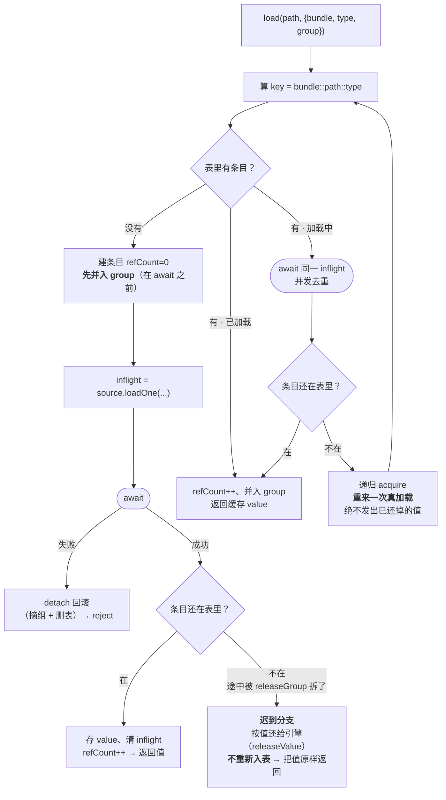
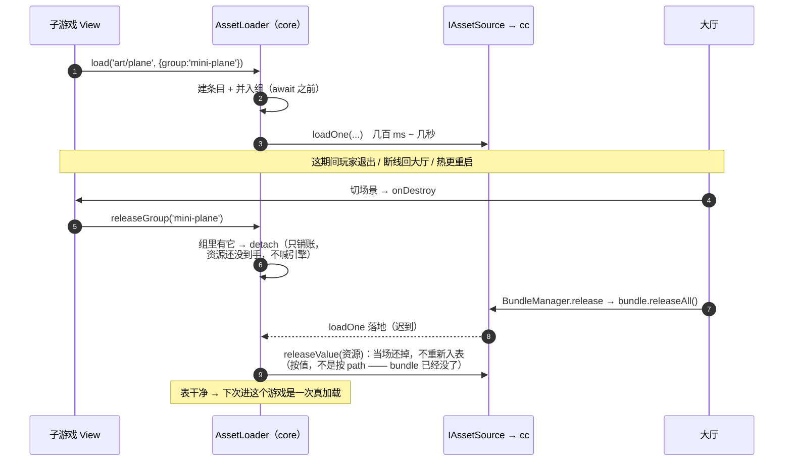

# AssetManager（IAssetLoader）设计文档

## TL;DR

`createAssetLoader({ source?, logger? })` 返回一个 `IAssetLoader`：`load<T>(path, opts?)` 从某 bundle（`opts.bundle`，缺省 `'resources'`）加载一个资源，返回 `Promise<T>`；内部 **引用计数**（同资源重复 load 只真加载一次、计数 +1）+ **并发去重**（并发 load 同键共享 inflight）+ **group 归组**（`opts.group` 打标，`releaseGroup(g)` 一键批量回收，对应界面/关卡级生命周期）。`release/loadDir/preload/loadRemote/get` 补齐。**core 零 cc**：定义消费接口 `IAssetLoader` + 引擎原子 IO 接缝 `IAssetSource`（`loadOne/loadDir/loadRemote/releaseOne` + 可选 `releaseValue`）+ 内存 fake；**资源类型用字符串 `AssetTypeToken`**（`'prefab'|'spriteFrame'|'audioClip'|...`），engine 侧维护 `token→cc Constructor` 映射——**cc 类型不进 core**。engine 后续注册 cc 适配到 `ASSET_SOURCE`，`createAssetLoader()` 自动拾取。失败收敛：`load→reject`、`release`/无键→告警不崩。

## Purpose（目标与定位）

- **做什么**：资源粒度的加载/释放，把散落的 `bundle.load/assetManager.releaseAsset` 收敛为一个带**引用计数 + 并发去重 + group 批量释放**的入口，守住 Cocos 最易错的资源生命周期（依赖资源误释放→黑图/崩，见横评 N1）。
- **定位/取舍**：**account-in-core / IO-in-engine**（横评 D2）——core 持账本逻辑（引用计数、inflight、group 归组、决定「何时真的调 engine 释放」）**可 node 单测**；engine `IAssetSource` 只做「真加载一个 / 真释放一个」原子 IO + Promise 化 + 错误映射。依赖 [[bundle-manager]]：`opts.bundle` 传 bundle name，engine 侧 `assetManager.getBundle(name).load(...)`；bundle 须先由 BundleManager 就绪。
- **为何 refCount 为主 + group 批量**（用户定 2026-07-27）：refCount 让依赖资源按引用回收（不误删他人仍用的贴图）；group 对应「一个 UI 关闭 / 一局结束」一次性回收该范围全部资源（横评 N7），下游 [[ui-manager]] 直接可用。
- **YAGNI（首版砍）**：加载取消（cc 无原生 cancel——用 inflight 去重 + 忽略结果代偿，不做真 cancel）；LRU/内存水位自动回收（先手动 + group）；资源热重载；加载优先级队列；bundle 间依赖预取（Cocos 自处理依赖）。

## Public API（TypeScript 精确签名）

```ts
// —— 资源类型 token（core 零 cc；engine 侧维护 token → cc Constructor<Asset> 映射）——
//  'asset' = 通配（走 assetManager.loadAny，不指定类型）。字符串联合带逃逸口，engine 可扩展。
export type AssetTypeToken =
  | 'asset' | 'prefab' | 'scene' | 'spriteFrame' | 'texture' | 'imageAsset'
  | 'audioClip' | 'json' | 'text' | 'material' | 'font' | 'animationClip'
  | (string & {});

export interface LoadOptions {
  bundle?: string;                                    // bundle name，缺省 'resources'（内置 bundle）
  type?: AssetTypeToken;                              // 缺省 'asset'（loadAny）
  group?: string;                                     // 归组，供 releaseGroup 批量回收
  onProgress?: (finished: number, total: number) => void;
}

// —— 引擎 IO 接缝（core 定义，engine/项目实现）：只做原子加载/释放 ——
export interface IAssetSource {
  loadOne<T = unknown>(path: string, opts?: { bundle?: string; type?: AssetTypeToken; onProgress?: (f: number, t: number) => void }): Promise<T>;
  loadDir<T = unknown>(dir: string, opts?: { bundle?: string; type?: AssetTypeToken; onProgress?: (f: number, t: number) => void }): Promise<T[]>;
  loadRemote<T = unknown>(url: string, opts?: { type?: AssetTypeToken }): Promise<T>;
  releaseOne(path: string, opts?: { bundle?: string; type?: AssetTypeToken }): void;
  releaseValue?(asset: unknown): void;                // 可选：按资源本身释放（bundle 已卸时 releaseOne 查不到）
}
export const ASSET_SOURCE: Token<IAssetSource>;       // engine 注册 cc 适配
export function createMemoryAssetSource(preset?: { assets?: Record<string, unknown> }): IAssetSource;  // 测试/默认 fake

// —— 消费接口（core 实现）——
export interface IAssetLoader {
  load<T = unknown>(path: string, opts?: LoadOptions): Promise<T>;       // 加载/引用；计数+1
  loadDir<T = unknown>(dir: string, opts?: LoadOptions): Promise<T[]>;   // 目录批量
  preload(path: string, opts?: LoadOptions): Promise<void>;             // 预热（加载但不计业务引用）
  loadRemote<T = unknown>(url: string, opts?: Omit<LoadOptions, 'bundle'>): Promise<T>;  // 远程散图/音/文本
  release(path: string, opts?: { bundle?: string; type?: AssetTypeToken }): void;        // 解引用；归零真释放
  releaseGroup(group: string): void;                                     // 批量解引用该组全部资源
  get<T = unknown>(path: string, opts?: { bundle?: string; type?: AssetTypeToken }): T | undefined;  // 取已加载缓存
}
export const ASSET_LOADER: Token<IAssetLoader>;
export function getAssetLoader(): IAssetLoader;        // tryResolve(ASSET_LOADER) ?? 进程默认
export function createAssetLoader(opts?: { source?: IAssetSource; logger?: ILogger }): IAssetLoader;
```

## Behavior & data flow（行为与数据流）

- **键**：`key = `${bundle}::${path}::${type}``（缺省 `resources::path::asset`）。同 path 不同 type/bundle 视为不同资源。
- **账本（AssetRegistry，core 纯逻辑）**：`Map<key, Entry>`，`Entry = { refCount, value?, inflight?: Promise, groups: Set<string> }`；另 `Map<group, Set<key>>` 反查。
- **load(path, opts)**：算 key →
  1. 有 `value`（已加载）→ `refCount++`、并入 group、返回缓存 `value`；
  2. 有 `inflight`（加载中）→ `await` 同一 inflight（**并发去重**）→ 回来先看条目是否还在表里（可能被 `releaseGroup` 拆了）：在 → `refCount++`、并入 group、返回 `value`；不在 → **重来一次真加载**（绝不把已还掉的值发出去）；
  3. 未加载 → 建 `Entry{refCount:0}`、**先并入 group**、`inflight = source.loadOne(path, {bundle,type,onProgress})`；成功且条目还在表里 → 存 `value`、清 inflight、`refCount++`、返回；成功但条目已被拆 → 这份是**迟到的**，当场还给引擎（按值，见下下条）、**不重新入表**、把值原样返回（调用方此时通常已死）；失败 → **回滚 Entry**（摘组删键）、`reject`。
- **并组为什么在 `await` 之前**（2026-08-25 修）：加载中的条目也必须归 scope 管。并组若晚于 `await`，这段窗口里资源不属于任何组 → scope 关闭时 `releaseGroup` **扑空**（组还没建，只打一句「组不存在」告警），等 load 落地又把组**重新建起来** → 从此没人还它；而 bundle 那边早被 `releaseAll` 拆干净，**下次同键 `load` 会命中这条脏缓存拿到已销毁的资源**（白图，且第三次进入才自愈）。触发面是「资源还在加载、scope 就被关掉」：子游戏加载贴图途中退出、UI 打开动画没走完就被关、远程 bundle 走 CDN 慢那几秒。
- **group 语义**：`load` 带 `group` 时把 key 记入该组、Entry.groups 加该组（同一 key 同组只记一次，重复 load 同组不重复占额）。
- **release(path, opts)**：算 key → 无 Entry→告警 no-op；`refCount--`；`<=0` → 销账（删 Entry + 从所有 group 移除）+ 还给引擎。
- **还给引擎按什么还**：**手里有资源本身就按值还**（`source.releaseValue`），否则按 path（`source.releaseOne`）。
  `releaseOne` 靠 bundle + path 反查资源，**bundle 已被卸载时反查不到 → 静默 no-op**；而「scope 关了、bundle 也卸了」
  正是最需要还的时候（上一条那个迟到分支就落在这里）。`releaseValue` 是**可选**方法，source 没实现就退回按 path，
  老实现不受影响。顺带也让 remote 资源（压根没有 bundle、按 path 永远还不掉）能被精确释放。
- **releaseGroup(g)**（**scope 强制拆除**，实现定稿语义）：取组内 keys 快照 → 逐 key `finalize`（真释放，**忽略各自 refCount**）、并从其所属的**所有** group 摘除；删该组。**加载中的条目只销账不喊引擎**（那份资源还没到手，`source.releaseOne` 无从谈起）——真释放由 `acquire` 的「迟到」分支收尾。语义 = 「这个界面/关卡我用完了，属于它的资源全部丢弃」，比「逐 refCount--」更简洁、更贴一键回收直觉。**约束**：跨多个 scope 共享的资源不要入组（会被任一组的 releaseGroup 拆掉）；确需共享的走手动 `load`/`release` 引用计数。组不存在→告警 no-op。
- **preload**：`source.loadOne` 但**不计业务 refCount**（或计到内部 `__preload` 组，用于预热后统一丢弃）→ 首版语义：加载进缓存、`refCount` 记 0 的「弱缓存」，后续 `load` 命中缓存直接 `refCount=1`。**定稿取「preload 不加业务引用、命中即转正」**（见决策 #6）。
- **loadDir**：`source.loadDir` 一次；对返回每个资源按其子路径建 Entry（refCount+1、并入 group）。释放走各自 path 或 releaseGroup。
- **get**：算 key 返回 `Entry.value`（core 自身缓存，未加载→undefined）。注意 caveat：引擎侧 autoRelease 可能在 core 不知情下失效缓存，v1 只反映 core 自身 load/release（文档标注）。
- **默认 source 解析**：`opts.source ?? getRootContainer().tryResolve(ASSET_SOURCE) ?? createMemoryAssetSource()`。
- **与 cc 边界**：IAssetLoader/IAssetSource/AssetRegistry/内存 fake 全在 core（零 cc）。engine 实现 `IAssetSource`：`loadOne`→`bundle.load(path, TypeMap[type], onProgress, cb)`（Promise 化 + `asset.addRef()`）、`releaseOne`→`asset.decRef()` 或 `bundle.release(path, type)`、`loadRemote`→`assetManager.loadRemote`。`AssetTypeToken→Constructor<Asset>` 映射表也在 engine。属**有状态引擎行为**，ADR-0002 不进 cc mock，走 apps/demo 集成验证。

### 图一：`acquire` 的决策树（load / preload / loadRemote 三入口共用）

两处「条目还在表里吗」是**取消检查**：`await` 期间整组可能已被 `releaseGroup` 拆掉，条目就此出表。



### 图二：加载途中 scope 被关（子游戏加载贴图时退出）



**并组若晚于 `await`**（2026-08-25 之前）：第 5 步查无此组（组还没建）→ 只打一句「组不存在」告警就走了，
**第 6、9 两步都不发生**；而第 8 步落地时 `addToGroup` 把组**重新建起来** → 从此没人还它，第 7 步却早已
把资源销毁 → 下次同键 `load` 命中这条脏缓存，拿到已销毁的 `SpriteFrame`（白图，第三次进入才自愈）。

## Key design decisions（决策表）

| # | 维度 | 选项 | 选定 | 理由 |
|---|---|---|---|---|
| 1 | refCount 归属 | 全靠 cc addRef/decRef / **core 建账本 + engine 原子 IO** | **account-in-core** | 计数/去重/group 逻辑脱离 cc 可 node 单测；engine 只两个原子 IO（横评 D2）|
| 2 | 资源类型表达 | cc Constructor 进 core / **字符串 AssetTypeToken** | **字符串 token**（用户定 2026-07-27） | core 零 cc 类型、可读、可 fake；engine 维护 token→cc 类映射（横评 D1）|
| 3 | 释放策略 | 强制 release / **refCount + group 批量** | **refCount + group**（用户定 2026-07-27） | refCount 防依赖误删；group 对应 UI/关卡级一键回收（横评 D4/N7）|
| 4 | 并发同键 load | 各自加载 / **inflight 去重** | **inflight 去重** | 并发只真加载一次、计数正确（N3）|
| 5 | bundle 关联 | 自己管 bundle / **依赖 BundleManager，opts.bundle 传 name** | **依赖 [[bundle-manager]]** | 分包生命周期归 BundleManager；本模块只在就绪 bundle 内取资源 |
| 6 | preload 语义 | 计业务引用 / **弱缓存、命中转正** | **弱缓存** | 预热不该占引用导致永不释放；后续 load 命中即 refCount=1 |
| 7 | 取消加载 | 真 cancel / **inflight 去重 + 忽略结果** | **不做真 cancel** | cc 无原生 cancel；YAGNI（横评 N2）|
| 8 | DI 便捷 | 仅工厂 / **ASSET_SOURCE + ASSET_LOADER token + getAssetLoader** | **都给** | 对齐 [[bundle-manager]]/[[save-manager]] token+fallback 范式 |

## Platform considerations（全平台 / 小游戏兼容）

- core（AssetLoader/AssetRegistry/内存 fake）纯 TS，全平台无差异。
- engine `IAssetSource` 适配：原生/Web/小游戏都走 `bundle.load`/`assetManager.loadRemote`，语义一致；native 有下载缓存（`cacheManager`），Web/小游戏无——对 core 账本透明。
- 资源释放的**依赖回收**依赖 cc 的 refCount（engine `addRef/decRef`）；core 账本的 refCount 是**业务引用层**，与 cc 资源层 refCount 两层配合（core 归零→engine `releaseOne`→cc 层按其 refCount 回收依赖）。
- 跨 bundle 共享 AssetLoader 走全局 `ASSET_LOADER` token（[[adr-0001]]）。

## Testable seams + test plan（可测接缝 + vitest 用例）

- **可测性**：全纯 TS 零 cc；`createMemoryAssetSource()` 作 IAssetSource 替身（返回预置资源、记录 loadOne/releaseOne 调用、可延迟/可抛错），fake logger 断言告警。
- **用例清单**（规划）：
  1. load 新资源 → source.loadOne 一次、返回值、get 命中；
  2. 同键重复 load → loadOne **只一次**、refCount=2；
  3. **并发** load 同键 → 共享 inflight、loadOne 一次、都 resolve；
  4. release 计数递减、归零→source.releaseOne + get 变 undefined；
  5. release 多于 load → 夹 0、告警；release 未加载键→告警 no-op；
  6. load 失败（source 抛错）→ reject、回滚不留键、可重试；
  7. **group**：两资源同 group、releaseGroup → 两者都 `releaseOne`、get 变 undefined、组清空；
  8. group 强制拆除忽略 refCount：同键 load 两次（refCount=2）后 releaseGroup → 仍一次清掉；一键属两组，releaseGroup 一组即拆除、另一组随之空（再 releaseGroup 另一组 → 告警）；
  8b. **加载途中 releaseGroup**（三条，钉住上面那个时序）：拆得到 inflight 条目（不再告警扑空）、拆时不喊引擎、迟到那份落地时当场还掉且不复活条目；拆过之后再 `load` 同键 → **真重新加载**；共享同一 inflight 的另一个等待方 → 自己重来一次真加载；
  8c. **按值释放**（三条）：source 实现了 `releaseValue` → 手里有资源就按值还、不再按 path 反查；迟到那份同样按值还；加载中就 `release`（手里还没有值）→ 退回按 path，等迟到那份落地再按值还；
  9. 不同 bundle/type 同 path → 不同键、独立计数；
  10. preload 弱缓存 → 不占业务引用；随后 load 命中 → refCount=1、loadOne 不重复；
  11. loadDir → 每个子资源建键、并入 group；
  12. loadRemote → 走 source.loadRemote；
  13. 默认 source：DI ASSET_SOURCE 优先、未注册退内存 fake；getAssetLoader token 优先/回退；
  14. AssetTypeToken 缺省 'asset'、bundle 缺省 'resources'（键规范化）。

## Open Questions（已决议 · 2026-07-27 定稿）

1. **字符串 token / refCount+group / 拆两模块**：✅（用户定）。
2. `AssetTypeToken` 逃逸口 `(string & {})`：允许 engine 扩展未列类型（如自定义 Asset 子类），core 不锁死。
3. `get()` 缓存与 cc autoRelease 的一致性：v1 只反映 core 自身 load/release，文档标 caveat；真需要强一致留后续（engine 回调通知失效）。
4. preload 是否需要「预热组统一丢弃」API：首版用弱缓存代偿，需要时再加 `releasePreloaded()`。
5. 与 [[ui-manager]]/[[audio-service]] 接缝：二者直接依赖 `IAssetLoader`（不再各包一层），group 用界面/音轨维度（横评 Q4）。

---

## 实现记录

- **落地文件**：`packages/core/src/asset/asset-source.ts`（`AssetTypeToken` + `IAssetSource` + `AssetSourceOptions` + `DirAssetItem` + `ASSET_SOURCE` + `createMemoryAssetSource`）、`asset-loader.ts`（`createAssetLoader` + `IAssetLoader`/`AssetLoadOptions` + `ASSET_LOADER` + `getAssetLoader`）、`index.ts`；core `index.ts` re-export（`export * from './asset'`）。
- **最终 API 与设计偏差**：
  1. 公共选项 `LoadOptions` → **`AssetLoadOptions`**（避免 core barrel `export *` 下泛名碰撞）。
  2. **`releaseGroup` 定为 scope 强制拆除**（整组 `finalize`、忽略各自 refCount），取代初稿「逐 refCount--」——更简洁可测、贴一键回收直觉；共享跨 scope 资源勿入组（详见 Behavior/决策表）。
  3. `IAssetSource.loadDir` 返回 **`DirAssetItem[]`（`{path, asset}`）**，使 core 能按各自 path 记账（初稿只说「返回资源」未定形态）。
  4. `loadRemote` 资源以 bundle=**`__remote`** 建键（与 bundle 内资源键空间隔离）。
  5. `preload` = 弱缓存（`countRef=false`、忽略 group）；后续 `load` 命中即计 1 引用、不重复加载。
  6. 统一 `acquire(key, path, bundle, type, group, countRef, loader)` 内核：load/preload/loadRemote 三入口共用（inflight 去重 + 失败回滚 + 命中缓存）。
  7. **并组提前到 `await` 之前 + 「迟到」分支**（2026-08-25）：初版并组晚于 `await`，加载中的资源不属于任何 scope（详见 Behavior 那条）。同批把 `finalize` 拆成 `detach`（只销账：摘组 + 删表）与 `finalize`（`detach` + 还给引擎）；失败回滚、拆 inflight 条目都只走 `detach`。
  8. **可选的 `IAssetSource.releaseValue`**（2026-08-26）：`releaseOne` 按 bundle+path 反查，**bundle 已被卸载时是静默 no-op** —— 而上一条那个迟到分支跑起来时 bundle 多半正好已经卸了（大厅 `release(bundle)` → `removeBundle`），于是账销了、引擎侧那份没还。手里有资源就按值还，退回按 path 兼容老实现。顺带解决了 remote 资源按 path 永远还不掉的遗留。
- **测试结果 / 覆盖率**：`asset-loader.test.ts` **30 用例全绿**；`asset-source.ts`、`asset-loader.ts` 均 **100% Stmts/Branch/Funcs/Lines**（全量 232 passed）。
- **commit / PR**：待提交（与 [[bundle-manager]] 同批）。
- **遗留 Minors**：`get()` 与 cc autoRelease 的强一致（引擎回调通知失效）留后续；[[ui-manager]]/[[audio-service]] 直接依赖 `IAssetLoader`（不再各包一层）。engine 侧 `IAssetSource` cc 适配 **已实现**（见下）。

### engine 半适配（IAssetSource 的 cc 实现，2026-07-28）

- **落地文件**：`packages/engine/src/asset-source.ts`（`createCcAssetSource` + `ccAssetModule`）、engine `index.ts` re-export。
- **实现**：
  - `loadOne` → `bundle.load(path, TYPE_MAP[type], onProgress, cb)` Promise 化（`cb=(err,asset)`）；
  - `loadDir` → `bundle.getDirWithPath(dir, ctor)` 先拿 path 清单，再逐个 `bundle.load` 配对成 `DirAssetItem{path,asset}`（cc `loadDir` 回调只给 `asset[]` 不带 path，故这样取 path）；
  - `loadRemote` → `assetManager.loadRemote(url, null, cb)`（cc 靠 url 扩展名判类型，首版忽略 `type`）；
  - `releaseOne` → `bundle.release(path, ctor)`；remote / 已卸载的 bundle → 反查不到，no-op；
  - `releaseValue` → `assetManager.releaseAsset(asset)`（`asset instanceof Asset` 才动手），**不查 bundle 表** —— `removeBundle` 之后 `getBundle(name)` 就是 null，而要还的恰恰是「bundle 已卸、资源才刚落地」那一份。与 `bundle.release(path)` 同语义（官方文档：`Bundle.release`「详细信息请参考 `AssetManager.releaseAsset`」）；
  - `TYPE_MAP`（`AssetTypeToken → Constructor<Asset>`）在 engine，`'asset'`/未知 → 通配 load；bundle 解析：`'resources'`/缺省 → 内置 `resources`，其余 → `assetManager.getBundle(name)`（未加载则 loadOne/loadDir throw）。
- **接入**：`ccAssetModule()` KitModule 注册 `ASSET_SOURCE → createCcAssetSource()`（模式同 `loggerModule`）；`bootCoreKit({ modules:[ccAssetModule()] })` 后 `getAssetLoader()` 自动拾取 cc source。
- **类型/测试策略**：这是**第一个「重 cc 模块」**，触发 **[[adr-0005]]**——engine typecheck 的 cc 类型改用官方 `@cocos/creator-types@3.8.7`（去 `paths.cc→mock`），cc mock 降为纯运行时替身；asset-source 的 cc API 被官方真类型**一次校验通过**。运行时行为不 mock（ADR-0002 决策 3），端到端走 apps/demo 真机。
- **与设计的偏差**：初稿设想 `addRef/decRef`，首版实际用 `bundle.release(path, type)`（更简单，cc 引擎层自管 refcount）。
- **验证**：`pnpm typecheck`/`build`/`test`(326)/`lint` **四门全绿**；**真机端到端（Creator 3.8.7 gameView 预览）已验证（2026-07-28，经 funplay MCP 自动起停预览 + 读 `project.log`）**——真 cc runtime 打出 `ASSET_SOURCE (cc) registered = true`（`ccAssetModule` 注册进组合根、DI 接入链路通）+ `✅ 真加载 resources/test-config.json via cc AssetSource` 并读出 `JsonAsset.json` 全字段（证 `bundle.load(path, JsonAsset, onProgress, done)` 对真引擎有效）。
  - **坑（记一笔）**：编辑器 **scene 进程**的 `cc.resources` 是**空壳**（`bundle:""`、`getDirWithPath` 返回 0）——它没有 QuickPack 为预览/构建生成的资源清单，`resources.load` 直接 `Can not parse this input`。故重 cc 模块的真加载**只能在预览 runtime 验，不能在 scene 编辑器上下文验**，印证 [[adr-0002]]「真实引擎行为下沉集成层」。触发 gameView 预览 = `Editor.Message.request('scene', 'editor-preview-set-play', true/false)`。
- **ponytail 取舍**：`loadDir` 逐个 load 非 cc 批量（量大再换按序 zip）。~~remote 精确释放未实现~~ → 2026-08-26 随 `releaseValue` 解决（按值还，不再需要 url→asset 映射）。
